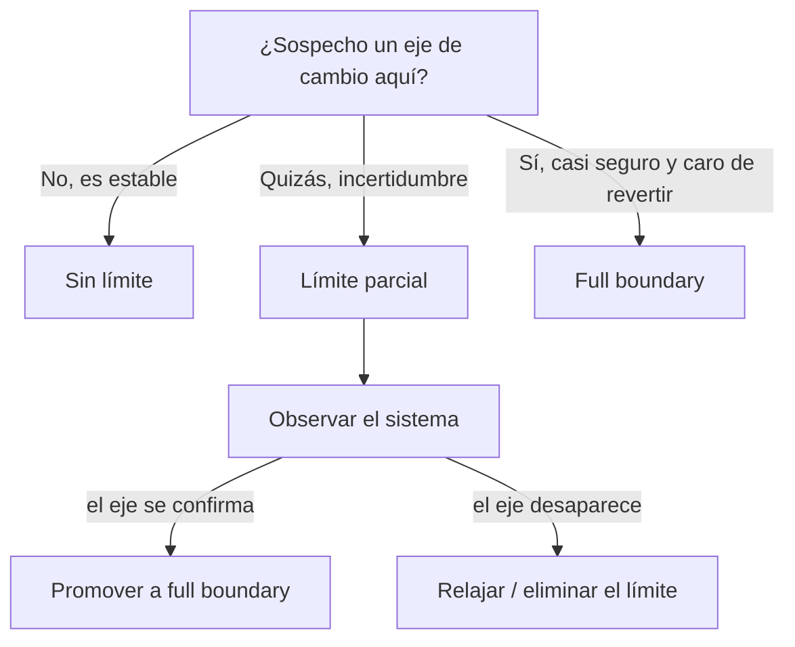

# 3. Elegir el nivel de rigor

## Los límites como decisiones vivas

Un límite arquitectónico no es una decisión que se toma una vez y se congela. Es una decisión que puede **reforzarse o relajarse con el tiempo** según cómo evolucione el sistema. El arquitecto observa dónde el código cambia junto y dónde cambia por separado, y ajusta el rigor de cada límite en consecuencia.

Colocar un límite completo donde no hacía falta es un desperdicio: se paga andamiaje y administración de componentes que nadie aprovecha. No colocar ningún límite donde sí hacía falta es igual de costoso: cuando el eje de cambio se manifiesta, hay que refactorizar bajo presión. Los límites parciales existen precisamente para navegar esa incertidumbre.

## Cómo elegir según el proyecto

La decisión depende de cuánta certeza hay sobre el eje de cambio y de cuánto puede costar equivocarse. Una guía práctica:



- Si la parte del sistema es estable y no se anticipa divergencia, no vale la pena ningún límite todavía.
- Si hay una sospecha razonable pero no certeza, un límite parcial deja plantada la costura a bajo costo.
- Si el eje de cambio es casi seguro y revertir sería carísimo, se justifica el full boundary desde el inicio.

## Reforzar o relajar con el tiempo

```
LÍNEA DE TIEMPO DE UN LÍMITE

  Sin límite  --->  Facade  --->  One-dimensional  --->  Full boundary
      |                |                 |                     |
      |  (reforzar cuando el dolor de acoplamiento crece) --> |
      |                                                        |
      | <-- (relajar cuando el andamiaje no aporta valor)      |
```

El arquitecto vigila el costo de cada límite frente al beneficio que entrega. Cuando el acoplamiento empieza a doler —cambios que se propagan, despliegues acoplados, equipos que se pisan— refuerza el límite subiendo un escalón de rigor. Cuando descubre que un límite completo solo estorba y nadie aprovecha su aislamiento, lo relaja para reducir la carga de mantenimiento.

## Trade-off central

| Nivel de rigor | Costo hoy | Aislamiento | Costo de promover luego |
|----------------|-----------|-------------|-------------------------|
| Sin límite | Ninguno | Ninguno | Muy alto (refactor completo) |
| Facade | Bajo | Bajo | Alto |
| One-dimensional | Bajo-medio | Medio | Medio |
| Skip the last step | Medio-alto | Alto | Bajo (solo separar despliegue) |
| Full boundary | Alto | Máximo | N/A (ya está) |

La clave del trade-off: **menos aislamiento significa menos costo hoy, pero más costo si luego hay que promover el límite a completo**. Elegir bien el nivel de rigor es, en el fondo, apostar sobre el futuro del sistema con la información disponible, y mantener abierta la posibilidad de corregir la apuesta.

## Punto clave para recordar

> El nivel de rigor de un límite es una decisión reversible que se calibra con el tiempo: se refuerza cuando el acoplamiento empieza a doler y se relaja cuando el andamiaje deja de aportar valor. La regla que guía la elección es que menos aislamiento cuesta menos hoy pero más si hay que promoverlo mañana.

---

Anterior: [Estrategias de partial boundaries](./02-estrategias-partial-boundaries.md)

Volver al índice: [README](./README.md)
