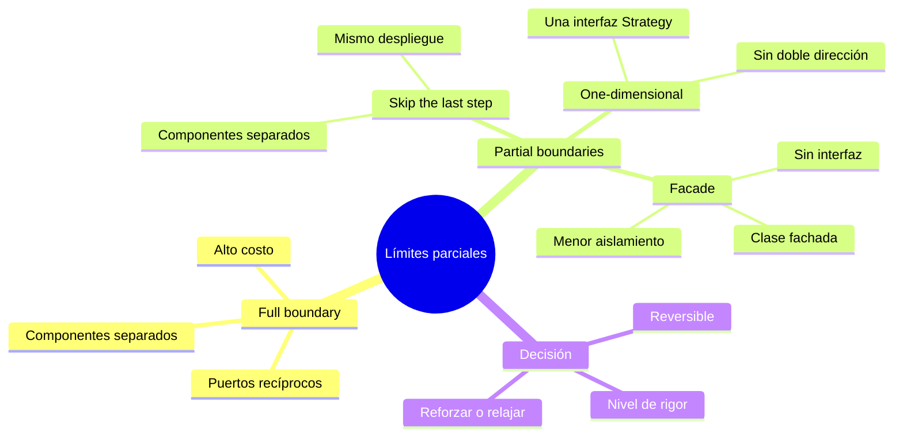

# Tópico 10 — Límites parciales y niveles de abstracción

> Contexto: No todo límite arquitectónico necesita ser completo. Un **full boundary** (límite completo) es costoso: exige puertos de entrada y salida recíprocos y componentes desplegables separados. Este tópico explora los **partial boundaries** (límites parciales), formas más baratas de preservar la separación cuando el costo total no se justifica todavía.

## Idea central del tópico

Los límites arquitectónicos son caros de construir y caros de mantener. Cuando el arquitecto anticipa que un límite *podría* ser necesario pero no está seguro, tiene opciones intermedias entre "ningún límite" y "un límite completo". Estas opciones parciales reducen el costo inicial a cambio de menos aislamiento. La habilidad clave es elegir el nivel de rigor adecuado y saber que esa decisión puede reforzarse o relajarse con el tiempo.

| # | Documento | Punto que cubre |
|---|-----------|-----------------|
| 1 | [Full vs partial boundaries](./01-full-vs-partial-boundaries.md) | Qué es un límite completo, qué es uno parcial y el costo/beneficio de cada uno |
| 2 | [Estrategias de partial boundaries](./02-estrategias-partial-boundaries.md) | Skip the last step, one-dimensional boundaries y facades |
| 3 | [Elegir el nivel de rigor](./03-elegir-nivel-de-rigor.md) | Cómo decidir cuánto rigor aplicar y tratar los límites como una decisión reversible |

## Relación con la arquitectura

Estos conceptos conectan directamente con la gestión de límites (boundaries) y con el principio de posponer decisiones. Un buen arquitecto no dibuja todos los límites completos desde el día uno: coloca límites parciales donde sospecha que habrá un eje de cambio y los promueve a completos solo cuando el dolor de no tenerlos supera el costo de construirlos. Así mantiene abiertas las opciones sin pagar por adelantado toda la complejidad.

## Referencia

Robert C. Martin, *Clean Architecture*, Prentice Hall, 2017.
