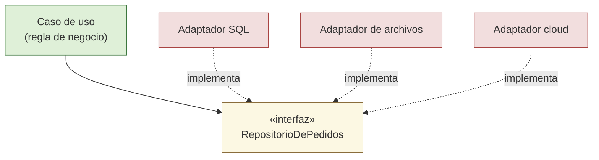

# 1. La base de datos es un detalle

La base de datos es uno de los detalles más malinterpretados de la arquitectura. Muchos equipos empiezan diseñando el esquema de tablas y construyen el sistema "alrededor" de la base de datos, como si fuera el corazón del software. Robert C. Martin sostiene lo contrario: **la base de datos es un detalle**, un mecanismo de almacenamiento que no debería influir en la forma de las reglas de negocio.

## La base de datos no es el modelo de datos

Es fácil confundir dos conceptos que no son lo mismo:

- El **modelo de datos** es importante. Describe la estructura de la información con la que trabaja el negocio: qué entidades existen, qué relaciones tienen, qué reglas las gobiernan.
- La **base de datos** es solo la tecnología que usamos para mover esos datos entre la memoria y un disco (o cualquier medio persistente). Es un mecanismo, no una decisión de negocio.

El sistema necesita datos organizados; **no** necesita, en cambio, un motor concreto. Que hoy sea PostgreSQL, mañana MySQL, un fichero plano o un almacén en la nube es irrelevante para las reglas de negocio. Ese es precisamente el sentido de tratar la base de datos como un detalle aplazable.

## Un mecanismo de almacenamiento entre muchos

Desde el punto de vista del núcleo, la persistencia se reduce a "guardar" y "recuperar" datos. La implementación puede variar sin que el negocio se entere:

```
             +----------------------------------+
             |   Reglas de negocio (núcleo)     |
             |   - Entidades                    |
             |   - Casos de uso                 |
             |                                  |
             |   Depende de una interfaz:       |
             |   +--------------------------+   |
             |   |  RepositorioDePedidos     |  |
             |   |  guardar(pedido)          |  |
             |   |  buscarPorId(id)          |  |
             |   +------------+-------------+   |
             +----------------|-----------------+
                              | (implementado por...)
        +---------------------+---------------------+
        |                     |                     |
        v                     v                     v
+---------------+     +---------------+     +----------------+
|  SQL (Postgres)|     |  Archivos     |     |  Almacén cloud |
|  implementación|     |  implementación|    |  implementación|
+---------------+     +---------------+     +----------------+
        ^                     ^                     ^
        |     Todos son intercambiables: DETALLES   |
        +-------------------------------------------+
```

La dirección de dependencia es clave: el núcleo define **qué** necesita (la interfaz del repositorio) y los detalles proveen el **cómo**.



## Las reglas de negocio no deben saber si hay SQL

Cuando una regla de negocio contiene consultas SQL, nombres de tablas o llamadas al driver de la base de datos, se ha filtrado un detalle hacia el núcleo. A partir de ahí, cambiar de motor obliga a tocar la lógica de negocio, y probar esa lógica exige una base de datos real.

| Aspecto | Base de datos como detalle (bien) | Base de datos como centro (mal) |
|---------|-----------------------------------|---------------------------------|
| Dónde vive el SQL | En un adaptador externo | Mezclado con la lógica de negocio |
| Qué sabe el núcleo | Solo una interfaz de repositorio | Tablas, columnas, dialecto SQL |
| Cambiar de motor | Se reemplaza un adaptador | Se reescriben reglas de negocio |
| Pruebas del negocio | Con un doble en memoria | Requieren una base de datos real |
| Decisión de motor | Aplazable | Tomada al inicio y "grabada en piedra" |

### ❌ La regla de negocio conoce el SQL

```java
class ServicioDePedidos {
    void confirmar(long idPedido) {
        Connection con = DriverManager.getConnection(URL_POSTGRES);
        PreparedStatement ps = con.prepareStatement(
            "UPDATE pedidos SET estado = 'CONFIRMADO' WHERE id = ?");
        ps.setLong(1, idPedido);
        ps.executeUpdate();
        // La lógica de negocio quedó atada a SQL y a Postgres.
    }
}
```

### ✅ La regla de negocio depende de una abstracción

```java
interface RepositorioDePedidos {
    Pedido buscarPorId(long id);
    void guardar(Pedido pedido);
}

class ServicioDePedidos {
    private final RepositorioDePedidos repositorio;

    ServicioDePedidos(RepositorioDePedidos repositorio) {
        this.repositorio = repositorio;
    }

    void confirmar(long idPedido) {
        Pedido pedido = repositorio.buscarPorId(idPedido);
        pedido.confirmar();          // regla de negocio pura
        repositorio.guardar(pedido); // persistencia = detalle externo
    }
}
```

El `ServicioDePedidos` ya no sabe si detrás hay SQL, archivos o un servicio remoto. Esa ignorancia es deliberada y valiosa: convierte la elección del motor en un detalle que puedes decidir tarde y cambiar sin miedo.

## Punto clave para recordar

> La base de datos es un detalle: un mecanismo de almacenamiento intercambiable. Lo que importa es el modelo de datos, no el motor. Mantén el SQL fuera del núcleo para que las reglas de negocio nunca sepan si hay una base de datos relacional, archivos o la nube detrás.

---

Siguiente: [La web es un detalle](./02-la-web-es-un-detalle.md)
