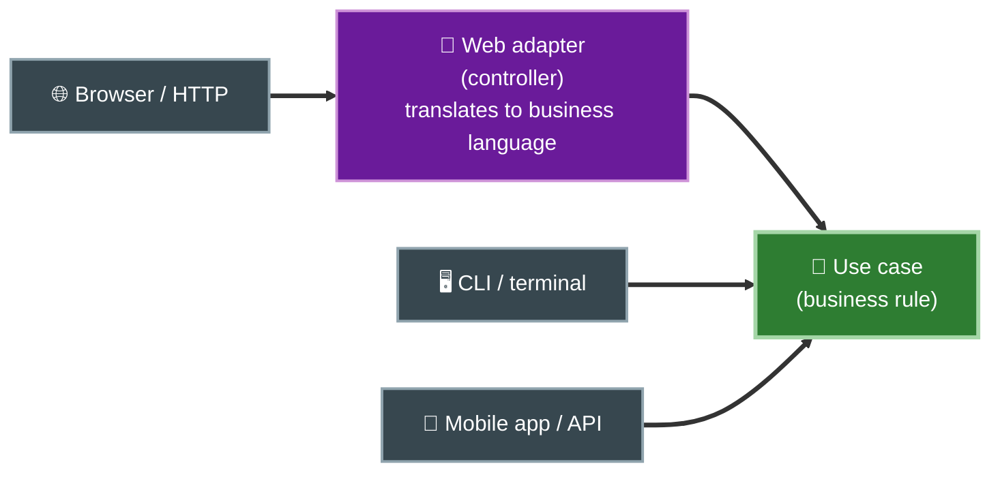
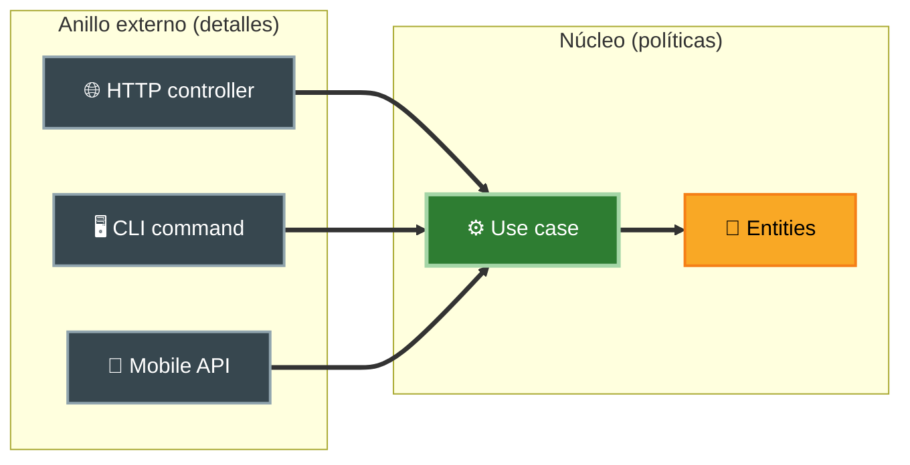

# 2. La web es un detalle

Durante años, la web pareció cambiarlo todo. Sin embargo, desde la perspectiva de la arquitectura, la web es simplemente **otro dispositivo de entrada/salida**. Robert C. Martin lo resume así: la web es un detalle. Es un canal por el que entran peticiones y salen respuestas, no el lugar donde deben vivir las reglas de negocio.

## Solo un canal de entrada/salida

La historia de la computación es un vaivén entre concentrar la lógica en el servidor y llevarla al cliente: terminales tontas, PCs, arquitecturas cliente-servidor, la web, aplicaciones ricas en el navegador, servicios en la nube. Cada oscilación pareció "definitiva" y ninguna lo fue. La conclusión práctica es que la interfaz gráfica y el canal por el que llega son **detalles volátiles**.

La web no es más que un mecanismo de I/O: recibe datos del usuario, se los entrega al negocio y devuelve al usuario la respuesta que el negocio produce. El corazón del sistema no debería notar la diferencia entre recibir esos datos por HTTP, por una terminal de texto, por una app móvil o por una llamada a una API.



La web es una fuente de I/O entre varias (CLI, app móvil, API): todas son detalles y todas apuntan hacia el mismo caso de uso.

## El negocio no debe atarse a HTTP

Si un caso de uso recibe directamente objetos `HttpServletRequest`, lee cabeceras, cookies o parámetros de query, entonces el negocio quedó acoplado al protocolo web. Ese acoplamiento impide reutilizar la lógica desde otro canal y obliga a levantar un servidor web solo para probar reglas de negocio.



Las flechas apuntan hacia adentro: los canales dependen del caso de uso, nunca al revés.

| Rol | Responsabilidad | Ubicación |
|-----|-----------------|-----------|
| Controlador web | Traducir HTTP a un modelo de petición del negocio | Anillo externo (detalle) |
| Caso de uso | Ejecutar la regla de negocio con datos neutrales | Núcleo (política) |
| Presentador | Traducir la salida del negocio a la vista | Anillo externo (detalle) |
| Vista / HTML | Renderizar la respuesta al usuario | Anillo externo (detalle) |

### ❌ El caso de uso habla HTTP

```java
class RegistrarUsuario {
    void ejecutar(HttpServletRequest req, HttpServletResponse resp) {
        String email = req.getParameter("email");      // atado a HTTP
        String nombre = req.getParameter("nombre");
        // ...lógica de negocio...
        resp.setStatus(201);                            // atado a HTTP
    }
}
```

### ✅ El caso de uso recibe datos neutrales

```java
// Modelo de petición del negocio: nada de HTTP
record SolicitudRegistro(String email, String nombre) {}

class RegistrarUsuario {
    ResultadoRegistro ejecutar(SolicitudRegistro solicitud) {
        // lógica de negocio pura, reutilizable desde cualquier canal
        return ResultadoRegistro.exito(/* ... */);
    }
}

// El detalle web vive en un controlador aparte:
class ControladorRegistroWeb {
    private final RegistrarUsuario caso;
    void manejar(HttpServletRequest req, HttpServletResponse resp) {
        var solicitud = new SolicitudRegistro(
            req.getParameter("email"), req.getParameter("nombre"));
        var resultado = caso.ejecutar(solicitud);
        resp.setStatus(resultado.creado() ? 201 : 400);
    }
}
```

Con esta separación, el mismo `RegistrarUsuario` sirve a la web hoy, a una CLI mañana y a una app móvil después. La web queda reducida a lo que realmente es: un detalle de entrada/salida que puedes aplazar, sustituir o multiplicar sin tocar el negocio.

## Punto clave para recordar

> La web es un detalle: un canal de entrada/salida más entre muchos. Mantén HTTP, cookies y HTML en el anillo externo y haz que los casos de uso trabajen con datos neutrales. Así el negocio no se ata a la web y puede exponerse por cualquier interfaz.

---

Anterior: [La base de datos es un detalle](./01-la-base-de-datos-es-un-detalle.md)  
Siguiente: [Los frameworks son detalles](./03-los-frameworks-son-detalles.md)
