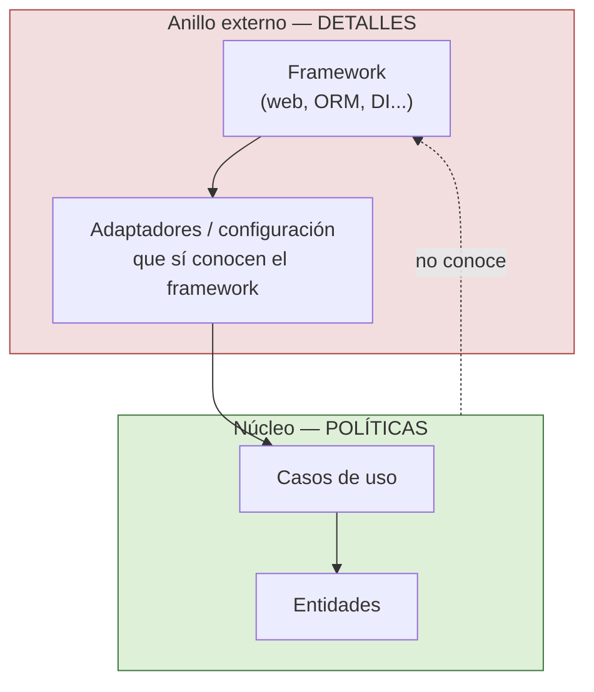

# 3. Los frameworks son detalles

Los frameworks son útiles y productivos, pero también son una de las trampas más comunes de la arquitectura. Robert C. Martin advierte que un framework es un **detalle** y que no debe ocupar el centro del sistema. El peligro no está en usarlo, sino en dejar que el framework defina la forma de tus reglas de negocio.

## El acoplamiento asimétrico

La relación con un framework rara vez es entre iguales. El autor del framework y tú tenéis intereses distintos: él vela por su ecosistema, sus versiones y su comunidad; tú velas por tu producto. El framework te pide un compromiso de un solo lado:

- Te pide que **heredes** de sus clases base.
- Te pide que **implementes** sus interfaces por todas partes.
- Te pide que **acomodes** tu código a sus convenciones y a su ciclo de vida.

A cambio, el framework **no** se compromete contigo. Este desequilibrio es lo que Martin llama **acoplamiento asimétrico**: tú te casas con el framework, pero el framework no se casa contigo.

```
        TÚ                              FRAMEWORK
    +-----------+                      +-----------+
    |  Tu código | ==== depende ====>  |  Autor y  |
    |            |                      |  su agenda |
    +-----------+                      +-----------+
         |                                   |
         |  "Cásate conmigo:                 |  "Yo no me
         |   hereda de mí,                   |   comprometo
         |   implementa mis                  |   con tu
         |   interfaces por todo"            |   producto"
         v                                   v
   Compromiso TOTAL  <----- asimetría -----> Compromiso NULO
```

Con el tiempo, el framework crece en direcciones que no te sirven, cambia de versión mayor, o queda abandonado. Si te casaste con él, sus problemas se convierten en los tuyos.

## Úsalo, pero no dependas de él desde el núcleo

La estrategia no es rechazar los frameworks, sino **mantenerlos a distancia**, en el anillo externo, tratándolos como herramientas que se usan desde fuera hacia adentro. Tus entidades y casos de uso no deben heredar de clases del framework ni conocer sus anotaciones o tipos.



El framework toca solo la periferia. Si mañana cambias de framework, reescribes los adaptadores del anillo externo, no las reglas de negocio.

| Práctica | ¿Mantiene el framework a distancia? |
|----------|-------------------------------------|
| Entidad que hereda de una clase base del framework | No: el núcleo queda casado con el framework |
| Anotaciones del framework en las entidades de negocio | No: la política depende del detalle |
| Framework confinado a adaptadores y configuración | Sí: vive en el anillo externo |
| Núcleo escrito en lenguaje puro, sin tipos del framework | Sí: el núcleo es independiente |
| Interfaces propias que un adaptador conecta al framework | Sí: inversión de dependencia |

### ❌ La entidad se casa con el framework

```java
// La regla de negocio hereda del framework y usa sus anotaciones.
@Entity
@Table(name = "pedidos")
class Pedido extends FrameworkModelBase {
    @Id @GeneratedValue
    private Long id;
    @Column
    private String estado;

    @FrameworkTransactional
    public void confirmar() { /* lógica atada al framework */ }
}
```

### ✅ La entidad es pura; el framework queda fuera

```java
// Núcleo: nada del framework, solo negocio.
class Pedido {
    private final PedidoId id;
    private EstadoPedido estado;

    void confirmar() {
        if (estado != EstadoPedido.PENDIENTE)
            throw new EstadoInvalido();
        estado = EstadoPedido.CONFIRMADO;   // regla pura
    }
}

// Anillo externo: aquí SÍ vive el framework (mapeo ORM, DI, etc.)
@Entity
@Table(name = "pedidos")
class PedidoRecord {
    @Id Long id;
    String estado;
    // se traduce a/desde Pedido en un adaptador de persistencia
}
```

La entidad `Pedido` no sabe que existe un framework. El acoplamiento asimétrico se contiene en `PedidoRecord`, que vive donde debe: en el borde. Así el framework sigue siendo un detalle que puedes aplazar y sustituir.

## Punto clave para recordar

> Un framework es un detalle con acoplamiento asimétrico: te pide que te cases con él sin comprometerse contigo. Úsalo desde el anillo externo, nunca desde el núcleo. Mantén tus entidades y casos de uso libres de sus tipos y anotaciones para poder cambiarlo el día de mañana.

---

Anterior: [La web es un detalle](./02-la-web-es-un-detalle.md)  
Siguiente: [Datos vs objetos](./04-datos-vs-objetos.md)
