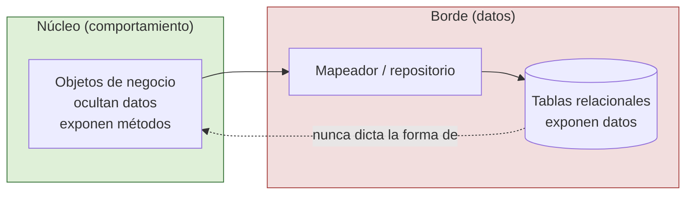

# 4. Datos vs objetos

Para entender por qué la forma de la persistencia es un detalle, conviene distinguir dos conceptos que a menudo se confunden: **datos** y **objetos**. Robert C. Martin usa esta distinción para explicar por qué las bases de datos relacionales exponen datos y por qué esa exposición no debe filtrarse a las reglas de negocio.

## Objetos: ocultan datos, exponen comportamiento

Un objeto orientado a objetos, en su forma más pura, **oculta sus datos** tras una frontera y **expone comportamiento** a través de funciones. No sabes (ni debes saber) cómo guarda su estado internamente; solo sabes qué puede hacer. Esta encapsulación es lo que permite cambiar la representación interna sin romper a quien lo usa.

- Un objeto dice: "no mires mis datos, pídeme que haga algo".
- Una estructura de datos dice: "aquí están mis datos, no tengo comportamiento significativo".

Son enfoques opuestos y complementarios. El código orientado a objetos facilita **añadir nuevos tipos** sin tocar las funciones existentes; el código orientado a datos facilita **añadir nuevas funciones** sin tocar las estructuras existentes.

## Las bases de datos relacionales exponen datos

Una base de datos relacional almacena **datos** en filas y columnas y los pone a disposición de cualquiera que sepa consultarlos. No encapsula comportamiento: expone estructura. Eso está bien para su propósito (almacenar y consultar), pero es exactamente lo contrario de lo que hace un objeto de negocio.

```
   OBJETO (negocio)                    TABLA RELACIONAL (persistencia)
  +----------------------+            +-------------------------------+
  |  Pedido              |            |  pedidos                       |
  |----------------------|            |-------------------------------|
  |  [datos ocultos]     |            |  id | cliente | total | estado |
  |----------------------|            |-----|---------|-------|--------|
  |  + confirmar()       |            |  1  |   A     |  99   | PEND   |
  |  + cancelar()        |            |  2  |   B     |  40   | CONF   |
  |  + total()           |            +-------------------------------+
  +----------------------+
   Expone COMPORTAMIENTO                Expone DATOS (estructura visible)
```

Si las reglas de negocio manipulan directamente filas y columnas, adoptan la forma de la base de datos: pasan a razonar en términos de estructura relacional en vez de comportamiento. En ese momento el detalle de persistencia se ha filtrado al núcleo.



| Criterio | Objeto (OO) | Estructura de datos / tabla relacional |
|----------|-------------|----------------------------------------|
| Qué muestra | Comportamiento (métodos) | Datos (campos, columnas) |
| Qué oculta | Sus datos internos | Nada; la estructura es visible |
| Facilita añadir | Nuevos tipos | Nuevas funciones sobre los datos |
| Papel en la arquitectura | Corazón del negocio | Detalle de persistencia |
| Debe filtrarse al núcleo | — | No |

### ❌ La regla de negocio piensa en filas y columnas

```java
class Facturacion {
    double total(ResultSet fila) {          // razona en términos de tabla
        return fila.getDouble("precio") * fila.getInt("cantidad");
        // la estructura relacional invadió la lógica de negocio
    }
}
```

### ✅ La regla de negocio piensa en comportamiento

```java
class LineaDePedido {                        // objeto: oculta datos
    private final Dinero precio;
    private final int cantidad;

    Dinero subtotal() {                       // expone comportamiento
        return precio.multiplicarPor(cantidad);
    }
}

// El mapeo entre filas y objetos vive en el borde, no en el negocio:
class MapeadorLineaDePedido {
    LineaDePedido desdeFila(ResultSet fila) { /* traduce datos -> objeto */ }
}
```

## Por qué la persistencia es un detalle

Como los objetos de negocio ocultan datos y las bases de datos relacionales los exponen, hay una tensión natural entre ambos. La resolvemos poniendo un **mapeador** en el borde que traduce filas en objetos y objetos en filas. Gracias a esa frontera:

- Las reglas de negocio razonan en términos de comportamiento, no de tablas.
- La forma de la persistencia (relacional, documental, en archivos) queda encerrada en el borde.
- Cambiar cómo se guardan los datos no cambia cómo se comportan los objetos.

Por eso la forma de persistencia es un **detalle aplazable**: puede decidirse tarde, cambiarse después y probarse aparte, sin que su estructura contamine el núcleo. Datos y objetos son cosas distintas, y mantenerlos separados es lo que permite que la base de datos siga siendo un detalle.

## Punto clave para recordar

> Los objetos ocultan datos y exponen comportamiento; las bases de datos relacionales exponen datos. Como son opuestos, la estructura de persistencia no debe filtrarse a las reglas de negocio. Traduce filas en objetos en el borde y la forma de guardar los datos seguirá siendo un detalle aplazable.

---

Anterior: [Los frameworks son detalles](./03-los-frameworks-son-detalles.md)  
Volver al índice: [README](./README.md)
