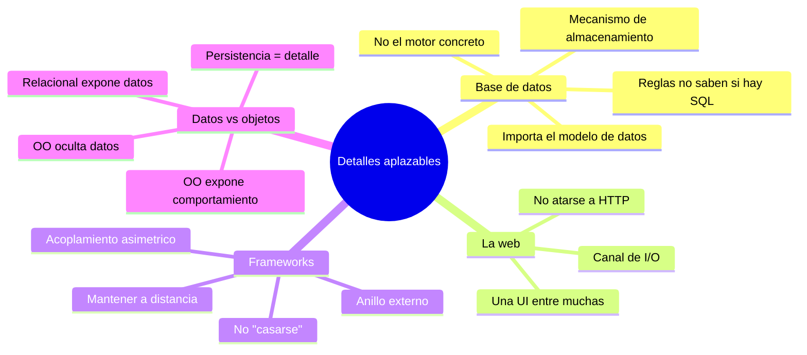

# Tópico 11 — Detalles como decisiones aplazables

> En *Clean Architecture*, Robert C. Martin distingue con firmeza entre las **políticas** (las reglas de negocio, lo que da valor al software) y los **detalles** (los mecanismos que dan soporte a esas políticas). La base de datos, la web y los frameworks son detalles: decisiones que una buena arquitectura permite **aplazar** y **mantener aisladas** del núcleo. Este tópico recorre por qué persistencia, UI y frameworks nunca deberían dictar la forma del sistema.

## Idea central del tópico

Una buena arquitectura permite **posponer y diferir** las decisiones sobre detalles. La base de datos, la web y el framework no son el corazón del sistema; son mecanismos intercambiables que viven en el anillo más externo. Cuando el núcleo de negocio no sabe si detrás hay SQL, archivos, HTTP o un framework concreto, esas decisiones se convierten en detalles aplazables: puedes tomarlas tarde, cambiarlas después y probarlas sin arrastrar todo el sistema. El error clásico es tratar un detalle como si fuera arquitectura, "casarse" con él y dejar que su forma contamine las reglas de negocio.

| # | Documento | Punto que cubre |
|---|-----------|-----------------|
| 1 | [La base de datos es un detalle](./01-la-base-de-datos-es-un-detalle.md) | La base de datos es un mecanismo de almacenamiento; importa el modelo de datos, no el motor. |
| 2 | [La web es un detalle](./02-la-web-es-un-detalle.md) | La web es solo un canal de I/O; el negocio no debe atarse a HTTP ni a la UI. |
| 3 | [Los frameworks son detalles](./03-los-frameworks-son-detalles.md) | El acoplamiento asimétrico y por qué no debes "casarte" con el framework. |
| 4 | [Datos vs objetos](./04-datos-vs-objetos.md) | Objetos ocultan datos y exponen comportamiento; la DB relacional expone datos: por eso es un detalle. |

## Relación con la arquitectura

Los detalles se ubican en el anillo externo del diagrama de círculos concéntricos. La **Regla de Dependencia** obliga a que las dependencias del código fuente apunten siempre hacia adentro, hacia las políticas. Esto significa que la base de datos, la web y los frameworks dependen del núcleo, y nunca al revés. El núcleo (entidades y casos de uso) define interfaces (puertos) que los detalles implementan. Gracias a esta inversión, cualquier detalle puede sustituirse (cambiar de motor de base de datos, exponer una nueva UI, migrar de framework) sin tocar las reglas de negocio. Aplazar los detalles no es pereza: es lo que mantiene abiertas las opciones y protege el valor real del sistema.

## Referencia

Robert C. Martin, *Clean Architecture*, Prentice Hall, 2017.
