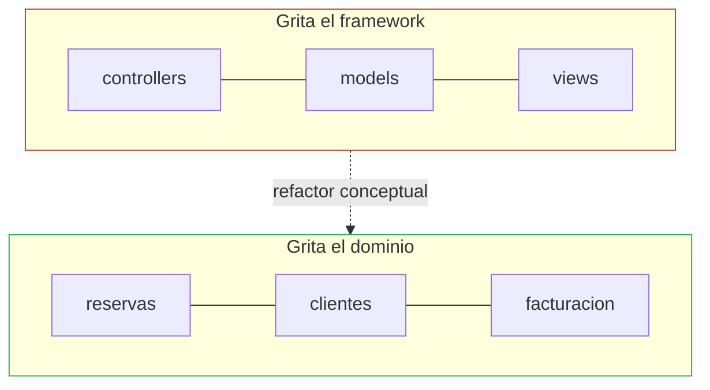
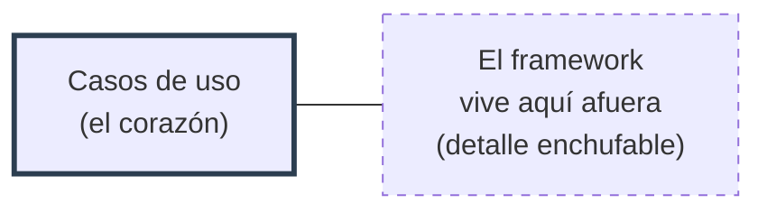

# 1. Screaming Architecture

## La metáfora del plano

Uncle Bob abre el capítulo con una analogía: al ver los planos de un edificio, entiendes de inmediato si es una casa, una biblioteca o una catedral. La forma **grita** su propósito.

> ¿Qué grita la arquitectura de tu aplicación? Al mirar la estructura de directorios de nivel superior, ¿grita "sistema de reservas de hotel" o grita "Rails"?

La estructura de un proyecto debe reflejar **de qué trata el sistema**, no las herramientas con que fue construido.

## El error común: la estructura grita el framework

La mayoría de los proyectos organizan sus carpetas siguiendo la plantilla del framework. El resultado es un árbol que habla de tecnología, no de negocio.

```
   proyecto-hotel/          (¿de qué trata esto?)
   ├── controllers/
   ├── models/
   ├── views/
   ├── services/
   ├── repositories/
   ├── config/
   └── migrations/
```

Un recién llegado ve esto y solo puede concluir: "es una app web MVC". No tiene ni idea de si gestiona **hoteles**, **hospitales** o **inventarios**. El propósito está escondido.

## El objetivo: la estructura grita el dominio

Compara con un árbol organizado por lo que el sistema **hace**:

```
   proyecto-hotel/          (¡grita "RESERVAS DE HOTEL"!)
   ├── reservas/
   ├── clientes/
   ├── habitaciones/
   ├── tarifas/
   ├── facturacion/
   └── disponibilidad/
```

Ahora el propósito es evidente antes de abrir un archivo. El framework, la base de datos y la UI quedan como **detalles** que se acomodan dentro de estos módulos, no al revés.



## Los casos de uso en el centro

Para Martin, una arquitectura debe estar centrada en los **casos de uso**, no en los frameworks. La estructura debería permitir describir el sistema en términos de lo que hace por sus usuarios.

| Aspecto | Arquitectura que grita el framework | Arquitectura que grita el dominio |
|---------|-------------------------------------|-----------------------------------|
| Carpeta raíz | Tecnología (MVC, Rails) | Casos de uso / conceptos de negocio |
| Legibilidad | Hay que leer código para entender el propósito | El propósito se ve en el árbol |
| El framework es... | El protagonista | Un detalle enchufable |
| Tests | Cuesta probar sin arrancar el framework | Reglas de negocio probables sin el framework |
| Diferir decisiones | Difícil (todo depende del framework) | Fácil (la BD/UI se deciden después) |

## El framework es un detalle, no un compromiso de por vida

Un framework es una herramienta útil, pero **casarse** con él contamina toda la estructura. Martin insiste: el framework debe mantenerse a distancia, en los anillos externos, para poder tomar decisiones tarde y reemplazarlo si hace falta.



Si tu arquitectura grita el dominio, podrás **posponer** la elección del framework, la base de datos y la web hasta tener suficiente información, y podrás cambiarlos sin reescribir las reglas de negocio.

## Punto clave para recordar

> **Tu arquitectura debe gritar el propósito del sistema, no el framework que usa.** Si el árbol de carpetas dice "reservas de hotel" en lugar de "Rails", vas por buen camino: el dominio es el protagonista y la tecnología es un detalle.

---

Siguiente: [Estrategias de empaquetado →](./02-estrategias-de-empaquetado.md)
