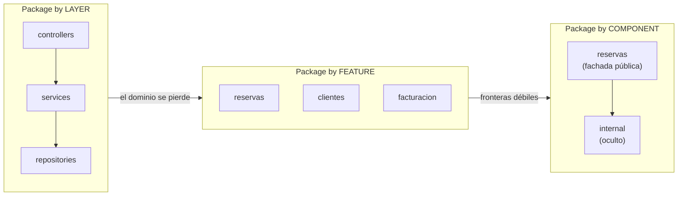

# 2. Estrategias de empaquetado

Existen tres formas clásicas de organizar los paquetes de una aplicación. Elegir bien determina si el dominio **grita** (ver documento anterior) y si las fronteras entre componentes son reales o ilusorias.

## Estrategia 1 — Package by layer (por capas)

Agrupa el código por su **rol técnico**: todos los controladores juntos, todos los servicios juntos, todos los repositorios juntos.

```
   src/
   ├── controllers/
   │   ├── ReservaController
   │   ├── ClienteController
   │   └── FacturaController
   ├── services/
   │   ├── ReservaService
   │   ├── ClienteService
   │   └── FacturaService
   └── repositories/
       ├── ReservaRepository
       ├── ClienteRepository
       └── FacturaRepository
```

Es la organización por defecto de casi todos los tutoriales. El problema: **esconde el dominio**. Para trabajar en "reservas" hay que saltar entre tres carpetas, y el árbol grita "arquitectura en capas", no "hotel".

## Estrategia 2 — Package by feature (por funcionalidad)

Agrupa el código por **concepto de negocio / caso de uso**. Todo lo de reservas vive junto.

```
   src/
   ├── reservas/
   │   ├── ReservaController
   │   ├── ReservaService
   │   └── ReservaRepository
   ├── clientes/
   │   ├── ClienteController
   │   ├── ClienteService
   │   └── ClienteRepository
   └── facturacion/
       ├── FacturaController
       ├── FacturaService
       └── FacturaRepository
```

Ahora el árbol **grita el dominio**. Trabajar en una feature toca una sola carpeta. La debilidad: los tipos suelen ser públicos, así que nada impide que `clientes` llame directo al `ReservaRepository`; las fronteras son de nombre, no reforzadas por el compilador.

## Estrategia 3 — Package by component (por componente)

Recomendada por Uncle Bob y por Simon Brown. Agrupa cada feature en un **componente con una frontera real**: una única fachada/interfaz pública, y todo lo demás oculto dentro.

```
   src/
   ├── reservas/                (COMPONENTE con frontera real)
   │   ├── ReservasComponent     ← única cara PÚBLICA (interfaz)
   │   └── internal/             ← PRIVADO: service, repo, entidades
   │       ├── ReservaServiceImpl
   │       ├── ReservaRepositoryImpl
   │       └── Reserva
   ├── clientes/
   │   ├── ClientesComponent
   │   └── internal/ ...
   └── facturacion/
       ├── FacturacionComponent
       └── internal/ ...
```

La UI/controlador solo puede hablar con `ReservasComponent`; no puede alcanzar el repositorio interno. La frontera se **hace cumplir** (por visibilidad de paquete o por módulos), no depende de la disciplina del equipo.



## Comparación de las tres estrategias

| Criterio | By layer | By feature | By component |
|----------|----------|------------|--------------|
| ¿Grita el dominio? | No, grita la tecnología | Sí | Sí |
| Cohesión por caso de uso | Baja (disperso en 3 carpetas) | Alta | Alta |
| Fronteras reforzadas | No | No (solo por convención) | Sí (visibilidad / módulos) |
| Riesgo de acoplamiento accidental | Alto | Medio | Bajo |
| Facilidad para extraer a microservicio | Baja | Media | Alta |
| Recomendación de Uncle Bob / Simon Brown | Evitar | Aceptable | **Preferida** |

## Ejemplo: la frontera que se hace cumplir

Con *package by component*, en Java bastaría dejar público solo el punto de entrada:

```java
// PÚBLICO: la única cara del componente
public interface ReservasComponent {
    ConfirmacionReserva reservar(SolicitudReserva solicitud);
}

// package-private: nadie fuera del paquete puede tocarlo
class ReservaServiceImpl implements ReservasComponent { /* ... */ }
class ReservaRepositoryImpl { /* ... */ }   // oculto por completo
```

El compilador impide que `clientes` importe `ReservaRepositoryImpl`. La frontera es real.

## Punto clave para recordar

> **Package by layer esconde el dominio; package by feature lo revela pero con fronteras débiles; package by component lo revela y además hace cumplir las fronteras.** Por eso Uncle Bob y Simon Brown recomiendan organizar por componentes con una única cara pública.

---

Anterior: [← Screaming Architecture](./01-screaming-architecture.md) · Siguiente: [Hexagonal y Clean →](./03-hexagonal-y-clean.md)
