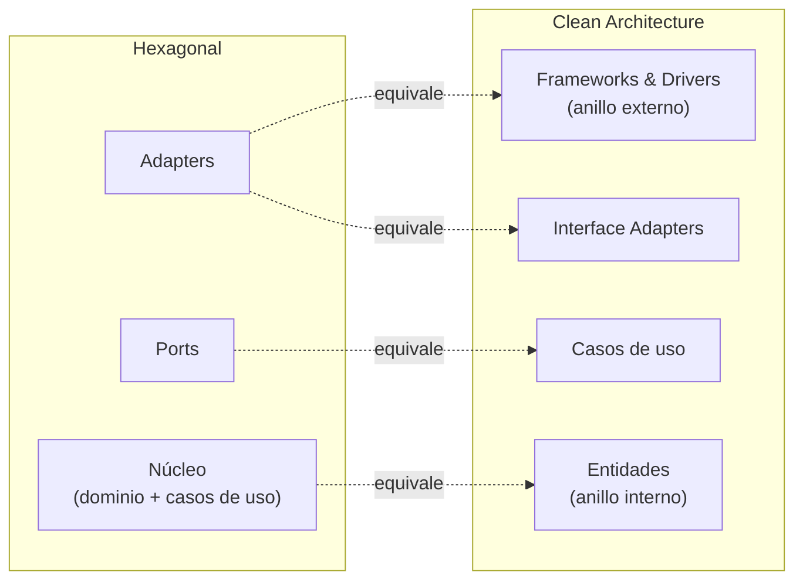

# 3. Arquitectura Hexagonal (Ports & Adapters) y su relación con Clean Architecture

## Qué es la Arquitectura Hexagonal

Propuesta por Alistair Cockburn, la **Arquitectura Hexagonal** (también llamada **Ports & Adapters**) plantea colocar la lógica de la aplicación en el centro de un hexágono y comunicarla con el mundo exterior únicamente a través de **puertos** (ports) implementados por **adaptadores** (adapters).

- **Port (puerto)** → una **interfaz**: define *qué* necesita o *qué* ofrece la aplicación, en términos del dominio.
- **Adapter (adaptador)** → una **implementación** concreta del puerto que habla con una tecnología específica (base de datos, HTTP, cola de mensajes, UI).

```
                 ADAPTERS (detalles)                PORTS (interfaces)
   ┌───────────────┐                        ┌───────────────────────────┐
   │  Controlador  │ ──llama al──►          │                           │
   │  REST / CLI   │        (driving port)  │      NÚCLEO / DOMINIO      │
   └───────────────┘                        │   (casos de uso + reglas) │
                                            │                           │
   ┌───────────────┐        (driven port)   │                           │
   │  Repositorio  │ ◄──implementa──         │                           │
   │  SQL / Mongo  │                        └───────────────────────────┘
   └───────────────┘
```

## Los dos lados del hexágono

| Lado | Nombre | Quién manda | Ejemplo de port | Ejemplo de adapter |
|------|--------|-------------|-----------------|--------------------|
| Izquierdo | Driving / primario | El exterior llama a la app | `ReservarHabitacion` (caso de uso) | Controlador REST, comando CLI |
| Derecho | Driven / secundario | La app llama al exterior | `RepositorioDeReservas` | Adaptador PostgreSQL, adaptador en memoria |

La clave: los adaptadores **dependen** de los puertos, nunca al revés. El núcleo no conoce ninguna tecnología.

## Equivalencia con Clean Architecture

Clean Architecture, Hexagonal y otras (Onion, DCI, BCE) son —según Uncle Bob— **variaciones de la misma idea**: reglas de dependencia que apuntan siempre hacia adentro. El mapeo es casi uno a uno.



| Concepto Hexagonal | Anillo de Clean Architecture |
|--------------------|------------------------------|
| Adapter (driving) | Interface Adapters / Frameworks & Drivers |
| Adapter (driven) | Frameworks & Drivers |
| Port | Interfaz de caso de uso / gateway |
| Núcleo | Casos de uso + Entidades (anillos internos) |

En ambos casos rige la **Regla de Dependencia**: el código fuente de los anillos internos no debe conocer nada de los externos. Los *ports* son justamente el mecanismo (inversión de dependencias) que permite que la flecha de dependencia apunte hacia adentro aunque el flujo de control salga hacia afuera.

## Ejemplo de un port y su adapter

```java
// PORT (interface) — vive en el núcleo, habla el idioma del dominio
public interface RepositorioDeReservas {
    void guardar(Reserva reserva);
    Optional<Reserva> buscarPorId(ReservaId id);
}

// ADAPTER (implementación) — vive afuera, conoce la tecnología
public class RepositorioDeReservasPostgres implements RepositorioDeReservas {
    public void guardar(Reserva reserva) { /* SQL, JDBC... */ }
    public Optional<Reserva> buscarPorId(ReservaId id) { /* SELECT... */ }
}
```

El caso de uso depende solo de `RepositorioDeReservas` (el port). Si mañana cambias Postgres por Mongo, escribes otro adapter y el núcleo no se entera.

## Por qué importa

- El dominio queda **aislado y probable** sin base de datos ni web (usas un adapter en memoria).
- Puedes **diferir** y **cambiar** decisiones tecnológicas (misma lección que Screaming Architecture).
- Es la misma inversión de dependencias que Clean Architecture; solo cambia el vocabulario.

## Punto clave para recordar

> **Ports son interfaces y adapters son implementaciones: Hexagonal es Clean Architecture con otro nombre.** El núcleo (dominio + casos de uso) no depende de ningún detalle; los adaptadores dependen del núcleo a través de los puertos, y la flecha de dependencia siempre apunta hacia adentro.

---

Anterior: [← Estrategias de empaquetado](./02-estrategias-de-empaquetado.md) · Siguiente: [El componente Main →](./04-el-componente-main.md)
