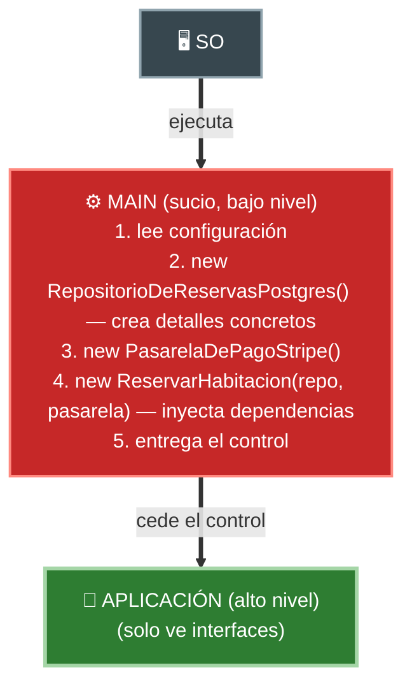
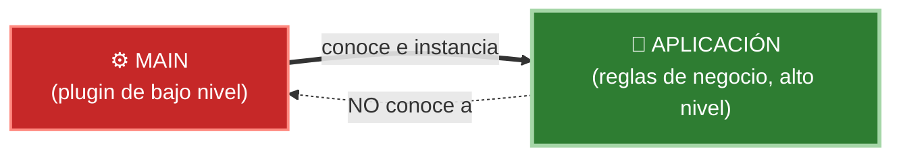

# 4. El componente Main

## El componente más sucio y de más bajo nivel

Toda aplicación tiene un punto de entrada: `main`. Uncle Bob lo describe como el componente **más de bajo nivel** del sistema, el más "sucio", y le asigna una misión muy concreta.

> Main es el punto de entrada inicial del sistema. Nada, salvo el sistema operativo, depende de él. Su trabajo es crear todas las Factories, Strategies y demás objetos globales, y luego ceder el control a la parte de alto nivel del sistema.

Main no contiene reglas de negocio. Es donde vive el desorden inevitable del arranque: leer configuración, abrir conexiones, instanciar clases concretas y **cablear** todo el sistema.

## Qué hace Main exactamente

1. **Crea las instancias concretas** de los detalles (repositorios, gateways, adaptadores).
2. **Resuelve la inyección de dependencias**: conecta cada detalle con la política que lo necesita, a través de sus interfaces (ports).
3. **Se las pasa al sistema** y le cede el control a los casos de uso de alto nivel.
4. Es el **único** componente que conoce todos los detalles a la vez.



## Main es un plugin de la aplicación

La idea más importante: la relación no es "la app es parte de main", sino al revés. **Main es un plugin** que se enchufa a la aplicación.



La aplicación **no sabe** que Main existe; solo recibe interfaces ya resueltas. Por eso puedes tener **muchos Main** distintos —uno por entorno (dev, test, prod) o por país— sin tocar las reglas de negocio.

| Aspecto | Main | Resto de la aplicación |
|---------|------|------------------------|
| Nivel | El más bajo | Alto (políticas de negocio) |
| Conoce los detalles concretos | Sí, todos | No, solo interfaces |
| Contiene reglas de negocio | No | Sí |
| Depende de... | De todo | De abstracciones |
| ¿Quién depende de él? | Nadie (salvo el SO) | — |
| Se puede intercambiar | Sí (un Main por entorno) | Es el núcleo estable |

## Ejemplo de ensamblado

```java
public class Main {
    public static void main(String[] args) {
        // 1. Detalles concretos (los "sucios")
        RepositorioDeReservas repo = new RepositorioDeReservasPostgres(config.db());
        PasarelaDePago pasarela   = new PasarelaDePagoStripe(config.stripeKey());

        // 2. Inyección de dependencias: se pasan por interfaz
        ReservarHabitacion casoDeUso = new ReservarHabitacion(repo, pasarela);

        // 3. Se cede el control al alto nivel
        Aplicacion app = new Aplicacion(casoDeUso);
        app.arrancar();
    }
}
```

`ReservarHabitacion` solo conoce `RepositorioDeReservas` y `PasarelaDePago` (interfaces / ports). Nunca supo que existían Postgres ni Stripe: eso lo decidió y armó **Main**.

## Por qué esta separación es valiosa

- Concentra todo el desorden del arranque en **un solo lugar**, dejando limpio el resto.
- Hace la inversión de dependencias **concreta**: es aquí donde las flechas se resuelven.
- Permite variar el ensamblado (mocks en test, Postgres en prod) sin tocar el dominio.

## Punto clave para recordar

> **Main es el componente más sucio y de más bajo nivel: crea las instancias concretas, resuelve la inyección de dependencias y cede el control al sistema.** Es el único que conoce todos los detalles, y es un plugin de la aplicación, nunca al revés.

---

Anterior: [← Hexagonal y Clean](./03-hexagonal-y-clean.md) · Volver al [índice del tópico ↑](./README.md)
