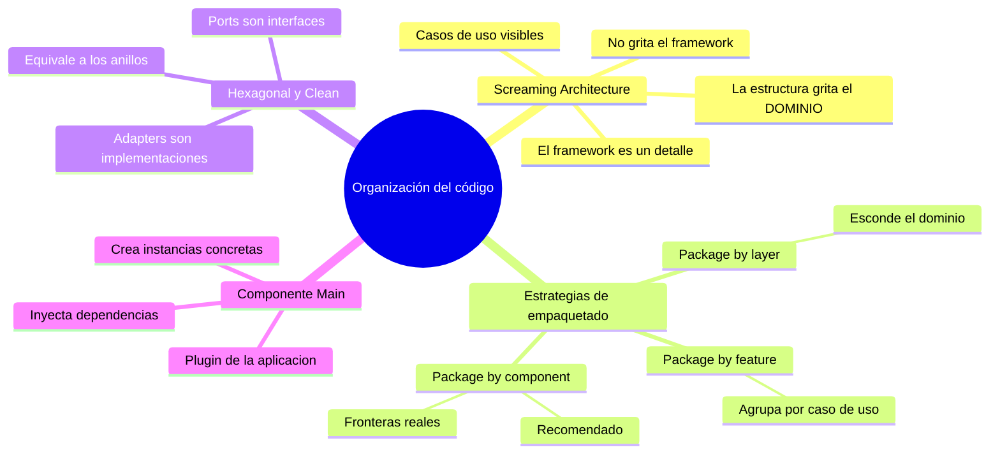

# Tópico 12 — Organización del código y estructura de paquetes

> Duodécimo bloque de la guía sobre **Clean Architecture** de Robert C. Martin.
> Cómo debe verse el árbol de carpetas de un sistema: qué debe "gritar" y qué debe esconder.

## Idea central del tópico

La estructura de un proyecto no es un detalle cosmético: es una decisión de arquitectura. Uncle Bob lo resume con una imagen potente:

> Al mirar el directorio raíz de tu aplicación, la estructura debe **gritar** el propósito del sistema (reservas de hotel, contabilidad, gestión de salud), **no** el framework que usa (Rails, Spring, Django).

Un buen empaquetado hace visible el **dominio** y oculta los **detalles** (frameworks, base de datos, UI). La forma en que agrupamos el código determina qué tan fácil es entenderlo, cambiarlo y desplegarlo por partes:

```
   ¿Qué grita tu carpeta raíz?

   MAL  →  controllers/  services/  repositories/  views/     (grita "MVC")
   MAL  →  config/  app/  db/  lib/                            (grita "Rails")
   BIEN →  reservas/  clientes/  habitaciones/  facturacion/   (grita "HOTEL")
```

Cuando el dominio grita, un recién llegado entiende **de qué trata el sistema** antes de abrir un solo archivo.

## Documentos de este tópico

| # | Documento | Punto que cubre |
|---|-----------|-----------------|
| 1 | [01-screaming-architecture.md](./01-screaming-architecture.md) | La estructura debe gritar el propósito del sistema, no el framework |
| 2 | [02-estrategias-de-empaquetado.md](./02-estrategias-de-empaquetado.md) | Package by layer vs by feature vs by component; ventajas y desventajas |
| 3 | [03-hexagonal-y-clean.md](./03-hexagonal-y-clean.md) | Ports & Adapters (Hexagonal) y su relación con Clean Architecture |
| 4 | [04-el-componente-main.md](./04-el-componente-main.md) | Main: el componente sucio de más bajo nivel que ensambla e inyecta dependencias |

## Diagrama del tópico



## Relación con la arquitectura

Este tópico conecta la teoría de los boundaries con la práctica de organizar carpetas:

- **Screaming Architecture** → la estructura refleja las reglas de negocio (los anillos internos de Clean Architecture), no los detalles externos.
- **Estrategias de empaquetado** → definen dónde caen las fronteras entre componentes; *package by component* materializa los boundaries en el árbol de carpetas.
- **Hexagonal** → los *ports* y *adapters* son otra forma de nombrar las abstracciones y los detalles, y encajan uno a uno con los anillos de Clean Architecture.
- **Main** → es el punto donde se resuelve la inversión de dependencias en concreto: crea los detalles y los conecta a las políticas.

## Referencia

- Robert C. Martin, *Clean Architecture*, Prentice Hall, 2017 — capítulos "Screaming Architecture", "The Clean Architecture" y "The Main Component".
