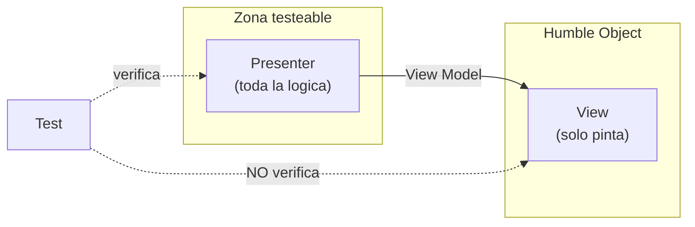

# 1. Testeabilidad y diseño orientado a pruebas

Los tests suelen tratarse como ciudadanos de segunda clase: código que se escribe rápido, que se acopla a cualquier detalle disponible y que nadie diseña con cuidado. Uncle Bob invierte esa idea por completo.

> Los tests son parte del sistema y, como tal, participan de la arquitectura. Deben diseñarse igual que cualquier otro componente.

## Los tests son usuarios del sistema

Desde el punto de vista de la arquitectura, **todos los tests son componentes**. Y como componentes, están sujetos a la **Regla de Dependencia**: apuntan hacia adentro, hacia el código que verifican, y nunca al revés.

- El sistema **no sabe** nada de los tests.
- Los tests **sí saben** del sistema.
- Por eso los tests son el ejemplo más externo de la arquitectura: el círculo más periférico de todos.

Esto tiene una consecuencia liberadora: como nada depende de los tests, los tests son el componente **más desacoplado** del sistema. Nunca deben ser desplegados y viven fuera del sistema en producción.

## El rol de la testeabilidad en el diseño

Un sistema difícil de testear casi siempre es un sistema mal diseñado. La dificultad para escribir un test es un **síntoma** de acoplamiento excesivo o de fronteras mal trazadas. Diseñar pensando en la prueba empuja hacia:

| Buen diseño (testeable) | Mal diseño (frágil) |
|-------------------------|---------------------|
| Reglas de negocio aisladas de la UI y la BD | Lógica mezclada con detalles de framework |
| Dependencias inyectadas y sustituibles | Dependencias creadas y ocultas dentro |
| Boundaries claros con interfaces | Llamadas directas a clases concretas |
| Comportamiento verificable sin arrancar todo el sistema | Necesita levantar toda la infraestructura |

## El patrón Humble Object aplicado a los tests

El **Humble Object** es un patrón de diseño para separar comportamientos difíciles de testear de comportamientos fáciles de testear. La idea: dividir un módulo en dos partes.

- La parte **humilde** (humble) contiene solo el código que es difícil de probar, reducido al mínimo, casi sin lógica.
- La parte **testeable** contiene toda la lógica interesante y se prueba sin depender de la parte difícil.

El caso clásico es la GUI: la presentación en pantalla es difícil de testear, así que se deja un *Presenter* con toda la lógica (testeable) y una *View* humilde que solo mueve datos a la pantalla.



El mismo principio aplica a bases de datos (gateways humildes), servicios externos y cualquier frontera con el mundo real. La lógica se aleja del límite y se concentra donde sí se puede probar.

## Vista de capas: dónde viven los tests

```
        +-----------------------------------------------+
        |   TESTS (el circulo mas externo de todos)     |
        |   +---------------------------------------+   |
        |   |  Frameworks & Drivers (UI, BD, Web)   |   |
        |   |  +---------------------------------+  |   |
        |   |  |  Adaptadores de interfaz        |  |   |
        |   |  |  +---------------------------+  |  |   |
        |   |  |  |  Casos de uso             |  |  |   |
        |   |  |  |  +---------------------+  |  |  |   |
        |   |  |  |  |  Entidades          |  |  |  |   |
        |   |  |  |  +---------------------+  |  |  |   |
        |   |  |  +---------------------------+  |  |   |
        |   |  +---------------------------------+  |   |
        |   +---------------------------------------+   |
        +-----------------------------------------------+
             Las dependencias SIEMPRE apuntan hacia adentro
```

Los tests envuelven al sistema, pero jamás forman parte de él en tiempo de ejecución.

## Punto clave para recordar

> Los tests son usuarios del sistema y siguen la Regla de Dependencia como cualquier otro componente. Diseñar para la testeabilidad —usando el patrón Humble Object para apartar lo difícil de probar— produce, casi como efecto secundario, una mejor arquitectura.

---

Siguiente: [02-fragil-arquitectura-de-pruebas.md](./02-fragil-arquitectura-de-pruebas.md)
