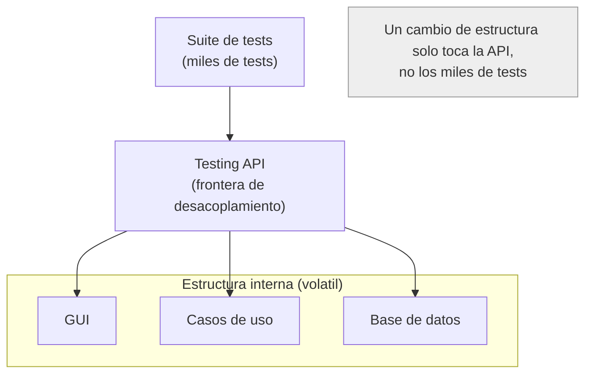

# 2. La frágil arquitectura de pruebas y el patrón Testing API

Muchos equipos que empiezan a testear en serio abandonan la práctica al poco tiempo. La causa casi nunca es la falta de disciplina: es que sus tests se vuelven **frágiles**, y una suite frágil cuesta más de mantener que el valor que aporta.

> El problema del diseño frágil de tests (*The Fragile Tests Problem*): cuando los tests están fuertemente acoplados a la estructura del sistema, cualquier cambio pequeño rompe cientos o miles de tests.

## Cómo nace la fragilidad

El escenario típico: los tests atacan directamente la GUI, la estructura de la base de datos o la forma exacta de las clases. Ejemplos de acoplamientos peligrosos:

- Tests que navegan la interfaz clic a clic contra botones y campos concretos.
- Tests que asumen columnas, tablas y esquemas específicos.
- Tests que dependen del orden interno de métodos o de la firma exacta de clases internas.

Cuando la estructura cambia —y siempre cambia— el efecto es demoledor:

```
   Se mueve un boton de la GUI
            |
            v
   +------------------------+
   |  1 cambio estructural  |
   +------------------------+
            |
            v
   +--------------------------------------+
   |  ~1000 tests rotos que no probaban   |
   |  ese boton, solo pasaban por ahi     |
   +--------------------------------------+
            |
            v
   El equipo deja de escribir tests
```

Un solo cambio provoca un daño desproporcionado. Esto viola una regla básica del diseño: cambios en el comportamiento deberían romper solo los tests de ese comportamiento.

## La solución: una Testing API

La respuesta de Uncle Bob es tratar el acoplamiento de los tests como cualquier otro acoplamiento indeseado: **introducir una frontera**. Esa frontera es una **Testing API** (API de pruebas): un conjunto de funciones creado específicamente para que los tests verifiquen el sistema **sin conocer su estructura interna**.

- La Testing API **esconde** la estructura del sistema a los tests.
- Los tests se escriben contra conceptos de negocio, no contra detalles.
- La estructura puede evolucionar libremente; solo hay que mantener la API.



## Separar la estructura de la verificación

La Testing API tiene un propósito doble:

| Objetivo | Qué desacopla |
|----------|---------------|
| Ocultar la estructura a los tests | Los tests no tocan clases ni tablas concretas |
| Ocultar los tests a la aplicación | La app no expone detalles solo para poder testear |
| Concentrar el acoplamiento | El único punto acoplado a la estructura es la API |

La API de pruebas es, ella misma, un patrón de **Humble Object** a escala: absorbe la volatilidad de la estructura para que los tests permanezcan estables y expresivos.

Un riesgo a evitar: que la Testing API se convierta en una puerta trasera que rompa reglas de negocio. La API debe respetar las mismas invariantes que el sistema; solo facilita el acceso, no relaja la seguridad ni la lógica.

## Punto clave para recordar

> Los tests acoplados a la estructura son frágiles: un cambio menor rompe miles de ellos y el equipo termina abandonando las pruebas. La cura es una Testing API que desacople los tests de la estructura interna, permitiendo que el sistema evolucione sin romper la suite.

---

Anterior: [01-testeabilidad-y-diseno.md](./01-testeabilidad-y-diseno.md)
Siguiente: [03-microservicios-y-servicios.md](./03-microservicios-y-servicios.md)
