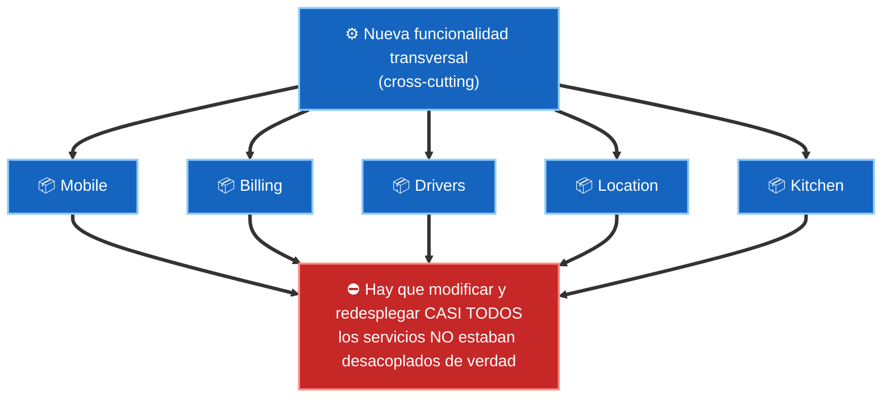
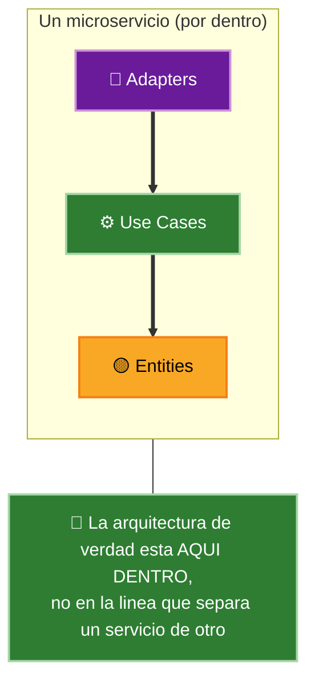

# 3. Servicios: ¿son realmente arquitectura?

Durante años se ha vendido la idea de que partir un sistema en servicios —y sobre todo en **microservicios**— produce automáticamente un diseño desacoplado, independiente y escalable. Uncle Bob desmonta ese mito.

> Los servicios que solo separan comportamiento en procesos no son, por sí mismos, arquitectura. La arquitectura la definen las líneas de dependencia, no las líneas de proceso.

## El mito del desacoplamiento por servicios

Se suele afirmar que los servicios están desacoplados porque corren en procesos o máquinas distintas y se comunican por la red. Es cierto que están desacoplados a **nivel de variables**: uno no puede acceder directamente a la memoria del otro. Pero eso no es lo que importa para la arquitectura.

Dos falacias frecuentes:

1. **"Los servicios están fuertemente desacoplados."** Falso en general: pueden acoplarse por los **datos que comparten**. Si dos servicios dependen del mismo registro o del mismo esquema, un cambio en ese dato obliga a cambiar ambos, y a redesplegarlos juntos.
2. **"Los servicios soportan la independencia de desarrollo y despliegue."** Solo parcialmente: si comparten datos o si un cambio de comportamiento atraviesa varios servicios, la supuesta independencia desaparece.

## El ejemplo del taxi: acoplamiento por una nueva funcionalidad

Martin usa un sistema de taxis dividido en microservicios. Añadir una funcionalidad transversal —por ejemplo, ofrecer viajes gratis a cachorros de una universidad— obliga a tocar **casi todos** los servicios a la vez:

La lección: dividir en servicios no evita el problema de los cambios que cruzan fronteras. Ese problema se resuelve con **buen diseño de componentes** (por ejemplo, el patrón que permite añadir la nueva feature sin tocar todo), y ese diseño es independiente de si el sistema es monolítico o de microservicios.

## Los servicios son un detalle de despliegue

La conclusión de fondo:

| Afirmación | Realidad según Clean Architecture |
|------------|-----------------------------------|
| "Un microservicio es una unidad de arquitectura" | No: es una unidad de **despliegue** y de escalado |
| "La línea de servicio es la frontera arquitectónica" | No: la frontera real son las líneas de dependencia |
| "Repartir en servicios ya desacopla" | No: se puede acoplar por datos compartidos |
| "La arquitectura está entre los servicios" | No: la arquitectura vive **dentro** de cada servicio |

Un servicio, por dentro, debe tener sus propios boundaries: entidades, casos de uso, adaptadores. Con esa estructura interna, el servicio puede seguir la Regla de Dependencia y hacerse extensible con componentes polimórficos, tal como un monolito bien diseñado.

Los servicios son útiles: escalan, aíslan fallos, permiten equipos independientes. Pero conviene tratarlos como lo que son —un detalle de despliegue— y no confundirlos con la arquitectura.

## Punto clave para recordar

> Trazar una línea de servicio no garantiza desacoplamiento: los servicios pueden acoplarse por datos compartidos y por cambios transversales. Los servicios son un detalle de despliegue; la verdadera arquitectura, con sus boundaries y su Regla de Dependencia, vive dentro de cada servicio.

---

Anterior: [02-fragil-arquitectura-de-pruebas.md](./02-fragil-arquitectura-de-pruebas.md)
Siguiente: [04-main-e-inyeccion-de-dependencias.md](./04-main-e-inyeccion-de-dependencias.md)
