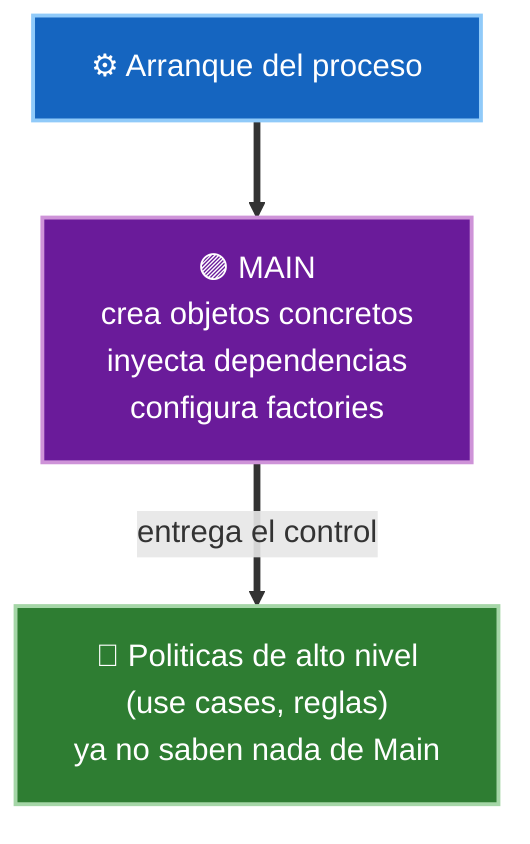
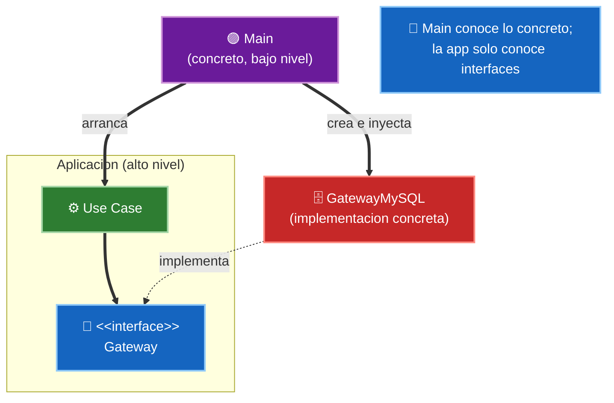

# 4. El componente Main y la inyección de dependencias

Todo sistema tiene un punto de entrada: la función `main`. Uncle Bob le dedica un lugar propio en la arquitectura porque, aunque parezca trivial, cumple un rol especial y muy concreto.

> `Main` es el detalle de más bajo nivel del sistema. Es el punto más sucio, del que nada depende, y su única misión es ensamblar el sistema y luego cederle el control.

## Main como el nivel más bajo

Piensa en `Main` como un plugin del resto de la aplicación:

- Es el **primer** código que se ejecuta y el **último** que importa.
- Está en el nivel más bajo posible de la política: nadie depende de él, él depende de casi todo.
- Al ser un plugin, se puede tener **un `Main` distinto por configuración**: uno para producción, otro para pruebas, otro para desarrollo, otro por país o cliente.

Como nada del sistema depende de `Main`, cambiarlo o reemplazarlo no obliga a tocar las políticas de negocio. Ahí es donde se concentra deliberadamente toda la suciedad de bajo nivel.

## Qué hace exactamente Main

`Main` se ocupa de tres tareas y ninguna más:

| Tarea de Main | Descripción |
|---------------|-------------|
| Crear | Instanciar los objetos concretos (fábricas, gateways, servicios, drivers) |
| Cablear (wiring) | Conectar esos objetos entre sí, resolviendo las dependencias |
| Arrancar | Entregar el control al componente de más alto nivel y desaparecer |

Después de eso, `Main` no vuelve a intervenir. Ha configurado el escenario y sale de la obra.

## Inyección de dependencias: Main ensambla

El componente `Main` es el lugar natural para la **inyección de dependencias**. La aplicación se escribe contra **abstracciones** (interfaces); `Main` es quien conoce las **implementaciones concretas** y las inyecta donde hacen falta.

Así se cumple la **Regla de Dependencia**: las flechas de código fuente apuntan desde `Main` (bajo nivel, concreto) hacia las abstracciones (alto nivel), nunca al revés.

De este modo, para cambiar una base de datos, un servicio externo o incluso todo el entorno, basta con escribir otro `Main` (o configurarlo distinto) sin tocar una sola regla de negocio.

## Punto clave para recordar

> `Main` es el componente más sucio y de más bajo nivel del sistema: crea los objetos concretos, resuelve la inyección de dependencias y cede el control a las políticas de alto nivel. Como nada depende de `Main`, concentra la suciedad de configuración y deja limpio el resto de la arquitectura.

---

Anterior: [03-microservicios-y-servicios.md](./03-microservicios-y-servicios.md)
Siguiente: [05-arquitectura-embebida.md](./05-arquitectura-embebida.md)
