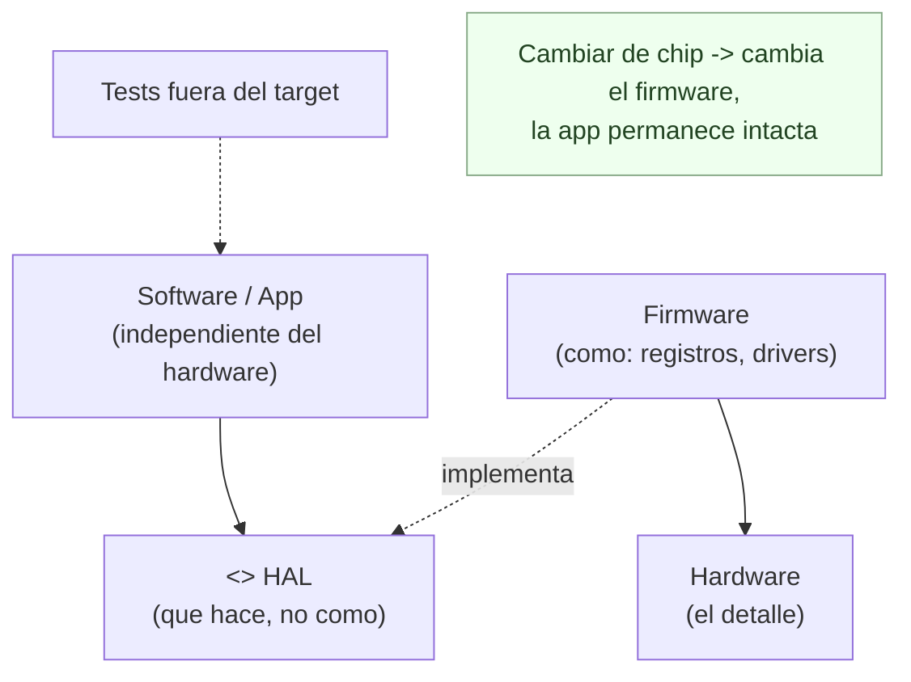

# 5. Clean embedded architecture: separar el software del firmware

El software embebido tiene fama de ser un mundo aparte, donde las buenas prácticas de arquitectura "no aplican" por las restricciones del hardware. Uncle Bob (con James Grenning) sostiene lo contrario: el embebido necesita arquitectura **más** que ningún otro, porque el hardware cambia y el software debería sobrevivirle.

> El software se distingue del firmware por su **dependencia del hardware**, no por el lenguaje ni por dónde se ejecute. El hardware es un detalle.

## Software vs. firmware: la distinción real

La palabra "firmware" no se refiere a que el código viva en una ROM. Se refiere a que el código **depende de los detalles del hardware**. Si tu lógica de negocio conoce registros, pines y direcciones de memoria, entonces es firmware, aunque esté escrito en C++ moderno y compilado con las mejores herramientas.

| Concepto | Depende del hardware | Debería cambiar cuando… |
|----------|----------------------|-------------------------|
| App / lógica de negocio | No | Cambian las reglas del negocio |
| Firmware | Sí (registros, pines, timers) | Cambia el chip o la placa |
| Hardware | — (es el detalle) | Se rediseña el producto |

El problema clásico: mezclar los tres. Cuando la app conoce el hardware, un cambio de chip obliga a reescribir reglas de negocio que nada tenían que ver con el chip. El código se convierte en un "ladrillo": no se puede mover a otro hardware.

## La barrera: HAL (y OSAL)

La solución es la misma que en cualquier arquitectura limpia: trazar una **frontera** con abstracciones. En embebido esa frontera es la **HAL — Hardware Abstraction Layer**.

- La **HAL** ofrece un servicio al software **sin revelar** cómo lo cumple el hardware. La app pide "enciende el LED de estado", no "escribe 1 en el bit 3 del puerto B".
- La **OSAL — Operating System Abstraction Layer** hace lo mismo con el sistema operativo: aísla la app de un RTOS concreto, para que cambiar de sistema operativo no propague cambios hacia arriba.

Con estas capas, la app queda **independiente del hardware y del SO**, y por tanto se puede compilar y **probar fuera del target**, en la máquina de desarrollo.

```
   +-------------------------------------------+
   |   Software (reglas de negocio, la "app")  |  <- NO conoce el hardware
   +-------------------------------------------+
   |   OSAL  (abstraccion del sistema oper.)   |
   +-------------------------------------------+
   |   HAL   (abstraccion del hardware)        |  <- la frontera clave
   +-------------------------------------------+
   |   Firmware (registros, drivers, pines)    |
   +-------------------------------------------+
   |   Hardware (el detalle)                   |
   +-------------------------------------------+
      Las dependencias apuntan hacia ARRIBA:
      el firmware conoce la HAL, no al reves
```

## La app no debe depender del hardware

Igual que en Clean Architecture la base de datos y la UI son detalles, aquí **el hardware es un detalle**. La HAL invierte la dependencia: la app depende de una interfaz estable, y el firmware la implementa.



Beneficios directos de separar software y firmware con una HAL/OSAL:

- **Portabilidad:** migrar a otro microcontrolador toca el firmware, no la app.
- **Testeabilidad:** la app se prueba en el PC, sin necesidad del hardware real.
- **Longevidad:** el software sobrevive a varias generaciones de hardware, evitando la "muerte por firmware" (código que se pudre porque no se puede cambiar el hardware sin reescribirlo todo).

## Punto clave para recordar

> En embebido, "firmware" no significa código en ROM: significa código que depende del hardware. Separando la app del firmware mediante una HAL (y una OSAL para el sistema operativo), el hardware se vuelve un simple detalle, la app queda portable y testeable fuera del target, y el software sobrevive al hardware.

---

Anterior: [04-main-e-inyeccion-de-dependencias.md](./04-main-e-inyeccion-de-dependencias.md)
Volver al índice: [README.md](./README.md)
