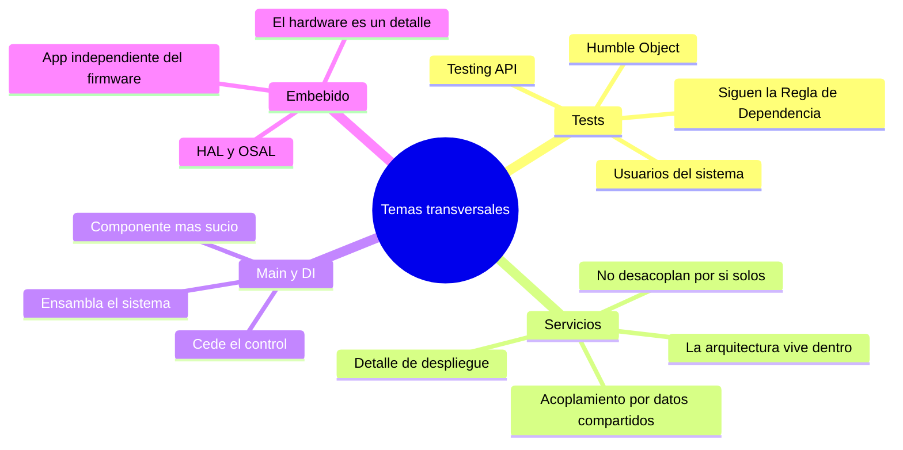

# Tópico 13 — Temas transversales y complementarios

> Bloque final de la guía sobre **Clean Architecture** de Robert C. Martin.
> Reúne temas que atraviesan toda la arquitectura: las pruebas, los servicios, el ensamblado del sistema y el software embebido.

## Idea central del tópico

Ningún tema de este tópico es un "apéndice". Todos comparten la misma tesis que recorre el libro:

> La **Regla de Dependencia** no se detiene en el código de producción. También gobierna los tests, los servicios, el arranque del sistema y hasta el firmware.

Los cuatro temas se resumen así:

- **Tests** → son un componente más del sistema, usuarios de la arquitectura, y deben seguir sus reglas (Humble Object, Testing API).
- **Servicios / microservicios** → una línea de servicio **no** garantiza desacoplamiento; los servicios son un detalle de despliegue.
- **Main + inyección de dependencias** → el punto más sucio y de más bajo nivel: ensambla el sistema y luego le cede el control.
- **Arquitectura embebida** → el hardware es un detalle; una HAL separa la app del firmware.

## Documentos de este tópico

| # | Documento | Punto que cubre |
|---|-----------|-----------------|
| 1 | [01-testeabilidad-y-diseno.md](./01-testeabilidad-y-diseno.md) | Los tests como parte del sistema, sujetos a la arquitectura y al patrón Humble Object |
| 2 | [02-fragil-arquitectura-de-pruebas.md](./02-fragil-arquitectura-de-pruebas.md) | La frágil arquitectura de pruebas y el patrón de "Testing API" |
| 3 | [03-microservicios-y-servicios.md](./03-microservicios-y-servicios.md) | ¿Son los servicios realmente arquitectura? El mito del desacoplamiento automático |
| 4 | [04-main-e-inyeccion-de-dependencias.md](./04-main-e-inyeccion-de-dependencias.md) | El componente Main y la inyección de dependencias |
| 5 | [05-arquitectura-embebida.md](./05-arquitectura-embebida.md) | Clean embedded architecture: separar software de firmware con una HAL |

## Diagrama del tópico

## Relación con la arquitectura

Cada tema demuestra que la arquitectura es una sola idea aplicada de forma consistente:

- Los **tests** deben mirar hacia adentro, igual que la UI o la base de datos, para no volverse frágiles.
- Los **servicios** dibujan una línea física, pero la línea arquitectónica real (los boundaries) sigue estando **dentro** de cada servicio.
- **Main** es el detalle de más bajo nivel: concentra la suciedad para que el resto quede limpio.
- El **firmware** es un detalle igual que la base de datos; una HAL mantiene la app independiente del hardware.

## Referencia

- Robert C. Martin, *Clean Architecture*, Prentice Hall, 2017 — capítulos sobre pruebas, servicios, el componente Main y la arquitectura embebida limpia.
