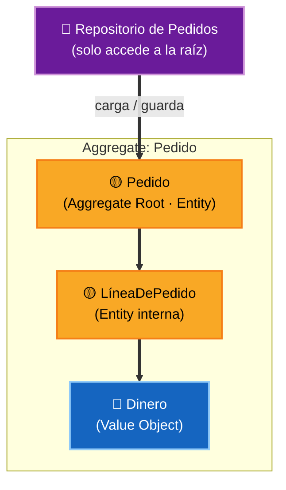
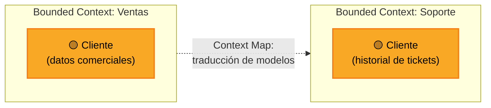

# 1. Domain-Driven Design (DDD)

**Domain-Driven Design** no es un patrón suelto, sino un enfoque completo para modelar software alrededor del **dominio del negocio**. Lo creó Eric Evans en 2003 y es el complemento natural de Clean Architecture: lo que Uncle Bob llama *Entities* y *Use Cases*, DDD lo describe con un vocabulario mucho más rico.

> El corazón del software está en el dominio. El diseño debe hablar el **mismo lenguaje** que los expertos del negocio, y el modelo del código debe ser un reflejo fiel de ese lenguaje.

## Dos niveles: estratégico y táctico

DDD se divide en dos planos. El estratégico decide *dónde* trazar las fronteras; el táctico decide *cómo* modelar lo que hay dentro de cada frontera.

| Nivel | Pregunta que responde | Bloques principales |
|-------|-----------------------|---------------------|
| Estratégico | ¿Dónde empieza y termina cada modelo? | Bounded Context, Ubiquitous Language, Context Map |
| Táctico | ¿Cómo represento el dominio en código? | Entity, Value Object, Aggregate, Domain Service, Repository |

## Bloques tácticos

Son las piezas con las que se construye el modelo dentro de un contexto.

- **Entity** — objeto con **identidad** propia que persiste en el tiempo (un `Cliente`, un `Pedido`). Dos entidades con los mismos datos pero distinto id son distintas.
- **Value Object** — objeto sin identidad, definido solo por sus **valores** (`Dinero`, `Dirección`, `RangoDeFechas`). Es inmutable y reemplazable.
- **Aggregate** — grupo de entidades y value objects que se tratan como una **unidad de consistencia**. Tiene una **raíz** (*Aggregate Root*) que es el único punto de entrada: nadie toca el interior sin pasar por ella.
- **Domain Service** — lógica de negocio que no pertenece naturalmente a una sola entidad (p. ej. una transferencia que involucra dos cuentas).
- **Repository** — abstracción para recuperar y guardar aggregates, como si fueran una colección en memoria. Es el mismo concepto que el *Gateway* de Clean Architecture.
- **Domain Event** — un hecho relevante que ya ocurrió en el dominio (`PedidoConfirmado`). Es la base de la comunicación entre contextos.

## Bloques estratégicos

Son los que deciden cómo partir un sistema grande, y por eso son clave al diseñar microservicios.

- **Ubiquitous Language** — un lenguaje único y compartido entre desarrolladores y expertos del negocio. Si el negocio dice "póliza", el código dice `Poliza`, no `InsuranceRecord`.
- **Bounded Context** — frontera explícita dentro de la cual un modelo y su lenguaje son coherentes. La palabra "cuenta" puede significar cosas distintas en *Facturación* y en *Soporte*; cada contexto tiene su propio modelo.
- **Context Map** — el mapa de cómo se relacionan los distintos contextos entre sí (quién depende de quién, qué traducciones hacen falta).

> La regla práctica más repetida: **un bounded context es un excelente candidato a convertirse en un microservicio.** La frontera del contexto se vuelve la frontera del servicio.

## DDD y Clean Architecture: la misma idea con otro nombre

Las dos disciplinas encajan sin fricción porque apuntan al mismo centro: proteger el dominio.

| DDD | Clean Architecture |
|-----|--------------------|
| Entity / Value Object / Aggregate | Entities (Enterprise Business Rules) |
| Domain Service | Use Cases (Application Business Rules) |
| Repository | Gateway / Interface Adapter |
| Bounded Context | El límite (boundary) de un componente o servicio |
| Infraestructura (ORM, mensajería) | Frameworks & Drivers |

En ambos casos el dominio es el anillo interior, estable, que **no depende** de la base de datos ni del framework.

## Punto clave para recordar

> DDD modela el software alrededor del dominio del negocio usando un **lenguaje ubicuo**. En lo táctico aporta Entity, Value Object y Aggregate (con su raíz como única puerta de entrada); en lo estratégico aporta el **Bounded Context**, que marca la frontera natural de un modelo y, muy a menudo, de un microservicio. Encaja con Clean Architecture porque ambos protegen el mismo núcleo de dominio.

---

Siguiente: [02-patrones-de-datos.md](./02-patrones-de-datos.md)
