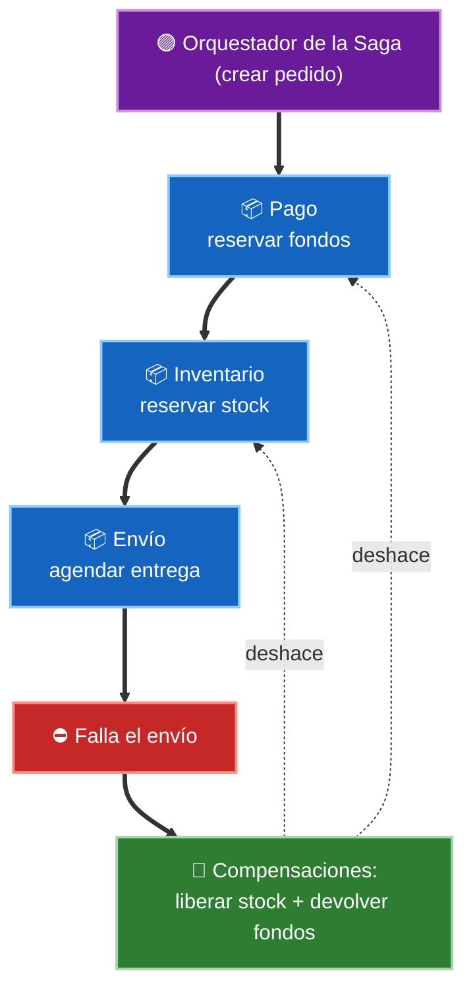
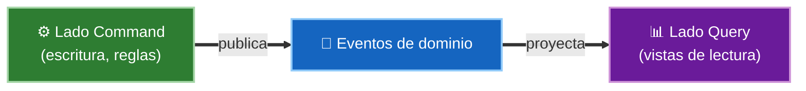
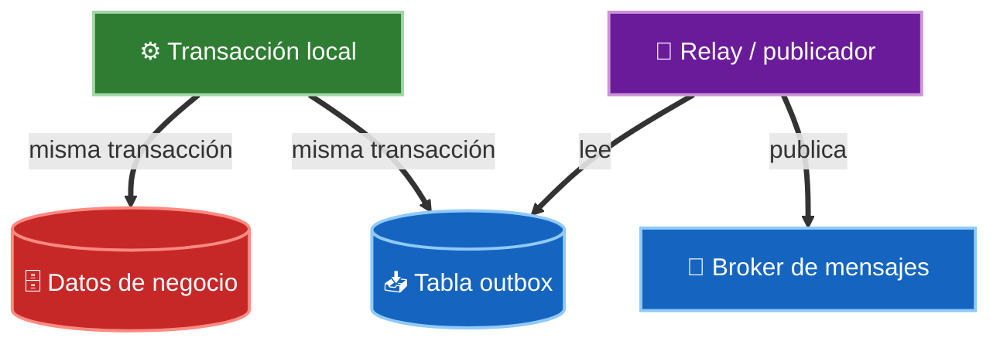

# 2. Patrones de datos distribuidos

Cuando un sistema se parte en servicios y cada uno tiene **su propia base de datos**, desaparece la red de seguridad del monolito: ya no existe una transacción ACID que abarque todo. Estos patrones resuelven cómo mantener los datos consistentes y consultables sin esa transacción global.

> En un sistema distribuido no puedes "hacer rollback" de media docena de bases de datos a la vez. La consistencia pasa de ser **inmediata** a ser **eventual**, y hay que diseñarla a propósito.

## Database per Service: el punto de partida

El patrón base de los microservicios: cada servicio es **dueño** de sus datos y nadie más los toca directamente. Si otro servicio los necesita, los pide por una API o reacciona a un evento.

- **Ventaja:** acoplamiento bajo, cada equipo evoluciona su esquema libremente.
- **Costo:** ya no hay JOINs ni transacciones entre servicios. De ahí nacen los demás patrones.

## Saga: transacciones que cruzan servicios

Una **Saga** reemplaza la transacción distribuida por una secuencia de **transacciones locales**. Cada paso confirma en su propia base de datos y publica un evento o manda un comando al siguiente. Si un paso falla, se ejecutan **compensaciones** que deshacen los pasos ya confirmados.

Hay dos formas de coordinar una saga:

| Variante | Cómo coordina | Ventaja | Inconveniente |
|----------|---------------|---------|---------------|
| **Coreografía** | Cada servicio reacciona a los eventos de los demás | Sin punto central, bajo acoplamiento | Difícil de seguir; la lógica queda dispersa |
| **Orquestación** | Un **orquestador** central dirige los pasos | Flujo explícito y fácil de depurar | El orquestador puede volverse un cuello de botella |

La compensación no es un rollback real: es una acción de negocio inversa (un reembolso, una cancelación). Por eso las sagas se diseñan pensando en qué significa "deshacer" cada paso.

## CQRS: separar escritura de lectura

**Command Query Responsibility Segregation** divide el modelo en dos:

- **Command** (escritura) — modelo normalizado, optimizado para aplicar reglas de negocio.
- **Query** (lectura) — una o varias vistas desnormalizadas, optimizadas para consultar rápido.

Las vistas de lectura se alimentan de los eventos que emite el lado de escritura, por lo que suelen quedar **eventualmente consistentes**. Es útil cuando lecturas y escrituras tienen cargas muy distintas, o cuando una consulta necesitaría unir datos de varios servicios.

## Event Sourcing: guardar los hechos, no el estado

En lugar de almacenar el **estado actual** de una entidad, Event Sourcing guarda la **secuencia de eventos** que la llevaron hasta ahí. El estado se reconstruye reproduciéndolos en orden.

- **Ventaja:** auditoría total, puedes reconstruir cualquier estado pasado y encaja de forma natural con CQRS.
- **Costo:** mayor complejidad; reconstruir desde cero es caro (se mitiga con *snapshots*), y versionar eventos viejos es delicado.

## Outbox: publicar eventos de forma fiable

Problema clásico: un servicio necesita **guardar en su base de datos** y **publicar un evento** de forma atómica. Si guarda y luego el broker falla, los demás servicios nunca se enteran.

El patrón **Outbox** resuelve esto escribiendo el evento en una tabla `outbox` **dentro de la misma transacción** que el cambio de datos. Un proceso aparte lee esa tabla y publica los eventos al broker.

Así el evento se guarda sí o sí junto al dato; su publicación posterior es un reintento garantizado, no una operación que pueda perderse.

## Dónde encajan en Clean Architecture

Ninguno de estos patrones pertenece al dominio. El Use Case expresa la intención ("confirmar pedido"); la **saga, el outbox o las proyecciones CQRS viven en adaptadores de infraestructura**. El dominio ni sabe que su persistencia está repartida en varios servicios.

## Punto clave para recordar

> Al dar a cada servicio su propia base de datos (Database per Service), se pierde la transacción global y la consistencia se vuelve **eventual**. **Saga** coordina transacciones locales con compensaciones (por coreografía u orquestación), **CQRS** separa escritura de lectura, **Event Sourcing** guarda los hechos en vez del estado, y **Outbox** publica eventos de forma fiable dentro de la misma transacción. Todos viven en la infraestructura, no en el dominio.

---

Anterior: [01-domain-driven-design.md](./01-domain-driven-design.md)
Siguiente: [03-patrones-de-resiliencia.md](./03-patrones-de-resiliencia.md)
