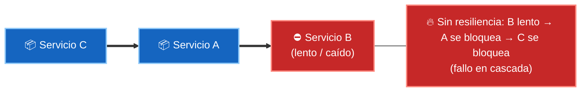
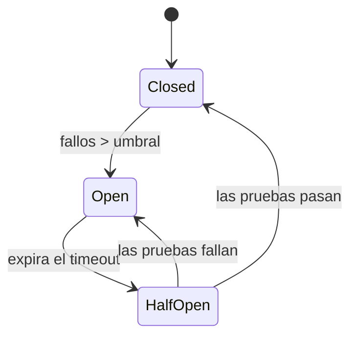
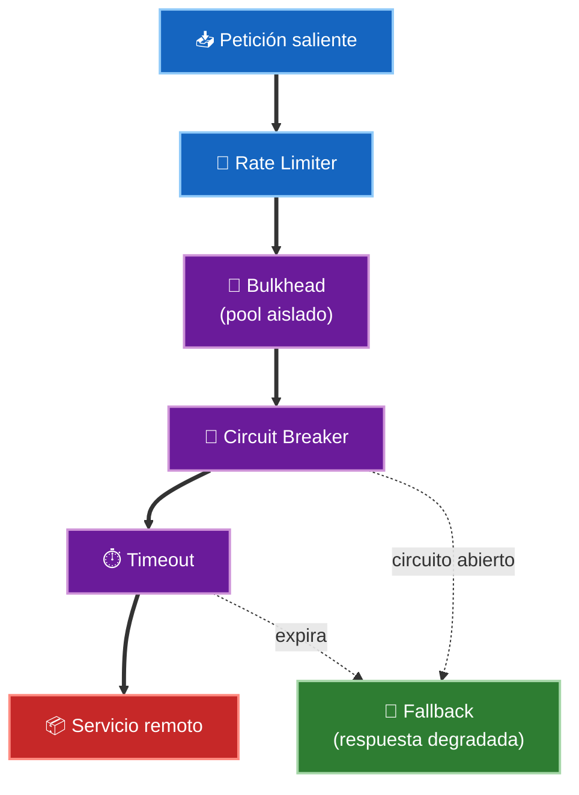

# 3. Patrones de resiliencia

En un monolito, una llamada a otro módulo o falla rápido o funciona. En un sistema distribuido, una llamada de red puede **tardar, colgarse o fallar a medias**, y un servicio lento puede arrastrar a todos los que dependen de él. Los patrones de resiliencia evitan que un fallo local se convierta en una caída total.

> En lo distribuido el fallo no es la excepción, es lo normal. El diseño no busca que nada falle, sino que **el sistema siga en pie cuando algo falla**.

## El enemigo: el fallo en cascada

Si el servicio A llama al B y el B se vuelve lento, los hilos de A se quedan esperando. Pronto A agota su pool de hilos esperando a B, y entonces el servicio C —que llamaba a A— también se bloquea. Un único punto lento tumba la cadena entera.

## Circuit Breaker: el interruptor automático

El patrón estrella. Funciona como el fusible de una casa: si un servicio dependiente empieza a fallar, el *breaker* **abre el circuito** y deja de llamarlo durante un tiempo, devolviendo el error de inmediato en vez de esperar. Así el servicio caído tiene margen para recuperarse y el que llama no se bloquea.

Tiene tres estados:

| Estado | Qué hace | Transición |
|--------|----------|------------|
| **Closed** (cerrado) | Deja pasar las llamadas y cuenta fallos | Si superan el umbral → **Open** |
| **Open** (abierto) | Rechaza al instante, sin llamar | Tras un tiempo de espera → **Half-Open** |
| **Half-Open** (semiabierto) | Deja pasar unas pocas llamadas de prueba | Si van bien → **Closed**; si fallan → **Open** |

## Los patrones que lo acompañan

El Circuit Breaker rara vez va solo. Se combina con otros mecanismos:

- **Timeout** — nunca esperar indefinidamente. Toda llamada remota lleva un límite de tiempo; sin él, el breaker ni siquiera puede detectar la lentitud.
- **Retry con backoff** — reintentar los fallos transitorios, pero **espaciando** los intentos (backoff exponencial) y añadiendo *jitter* (aleatoriedad) para no bombardear al servicio que se está recuperando. Solo tiene sentido para operaciones **idempotentes**.
- **Bulkhead** (mamparo) — aislar recursos en compartimentos separados, como los mamparos de un barco. Si las llamadas al servicio B tienen su propio pool de hilos, agotarlo no afecta a las llamadas al servicio C.
- **Fallback** — cuando algo falla, devolver una respuesta **degradada** pero útil: un valor en caché, un dato por defecto, o una lista vacía en vez de un error.
- **Rate Limiting / Throttling** — limitar cuántas peticiones se aceptan por unidad de tiempo, para proteger al servicio de picos o abusos.

## Dónde encajan en Clean Architecture

Toda esta maquinaria vive en el **gateway** que llama al servicio externo, es decir, en la capa de adaptadores/infraestructura. El Use Case solo conoce la interfaz (`ServicioDePagos`); no sabe si detrás hay un circuit breaker, reintentos o un fallback. Si mañana cambias de librería de resiliencia, el dominio ni se entera.

## Punto clave para recordar

> En lo distribuido, los fallos parciales son inevitables y pueden propagarse en cascada. El **Circuit Breaker** corta las llamadas a un servicio que falla (closed → open → half-open) y se combina con **Timeout**, **Retry con backoff**, **Bulkhead**, **Fallback** y **Rate Limiting**. Todos viven en los gateways de la capa de adaptadores: el dominio solo ve una interfaz limpia.

---

Anterior: [02-patrones-de-datos.md](./02-patrones-de-datos.md)
Siguiente: [04-patrones-de-comunicacion.md](./04-patrones-de-comunicacion.md)
