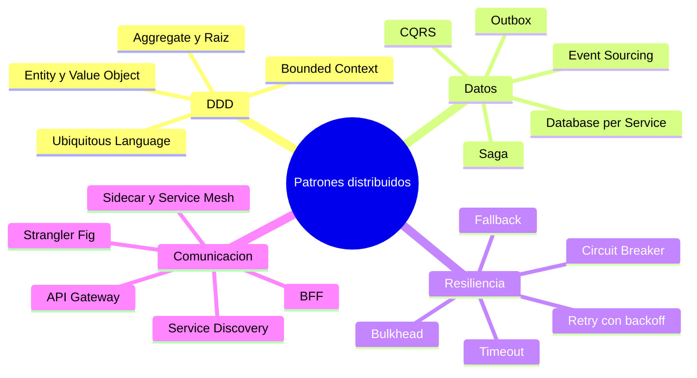

# Tópico 14 — Patrones de sistemas distribuidos y microservicios

> **Módulo complementario**, separado del cuerpo de *Clean Architecture* de Robert C. Martin.
> Reúne los patrones que aparecen cuando el sistema se reparte en varios procesos o servicios: diseño de dominio (DDD), consistencia de datos (Saga, CQRS), resiliencia (Circuit Breaker) y comunicación (API Gateway, BFF).

## Por qué un módulo aparte

Estos patrones **no forman parte** de Clean Architecture. Pertenecen al mundo de los sistemas distribuidos y los microservicios. Se documentan aquí como anexo porque son el complemento natural del tópico 13 (servicios), y conviene entender cómo encajan con la Regla de Dependencia:

> Un microservicio es un **detalle de despliegue**. Patrones como Saga o Circuit Breaker viven en la capa de **adaptadores / infraestructura**. El dominio (Entities y Use Cases) no debería saber que existen.

Dicho de otro modo: Clean Architecture organiza el **interior** de cada servicio; estos patrones organizan la **conversación entre servicios**. Son niveles distintos y compatibles.

## Idea central del tópico

Cuando partes un sistema en procesos independientes, aparecen tres problemas que un monolito no tenía:

- **Consistencia** → ya no hay una transacción ACID que abarque todo. Entran Saga, CQRS, Event Sourcing, Outbox.
- **Fallos parciales** → un servicio puede caer sin tumbar al resto. Entran Circuit Breaker, Retry, Bulkhead, Timeout.
- **Topología** → hay que localizar, enrutar y adaptar la comunicación. Entran API Gateway, BFF, Service Discovery, Sidecar.

Y por encima de todos, **DDD** aporta el lenguaje para decidir *dónde* trazar las fronteras entre servicios (los *bounded contexts*).

## Documentos de este tópico

| # | Documento | Punto que cubre |
|---|-----------|-----------------|
| 1 | [01-domain-driven-design.md](./01-domain-driven-design.md) | DDD: bloques tácticos (Entity, Value Object, Aggregate) y estratégicos (Bounded Context) |
| 2 | [02-patrones-de-datos.md](./02-patrones-de-datos.md) | Consistencia distribuida: Saga, CQRS, Event Sourcing, Outbox, Database per Service |
| 3 | [03-patrones-de-resiliencia.md](./03-patrones-de-resiliencia.md) | Tolerancia a fallos: Circuit Breaker, Retry, Bulkhead, Timeout, Fallback |
| 4 | [04-patrones-de-comunicacion.md](./04-patrones-de-comunicacion.md) | Topología: API Gateway, BFF, Service Discovery, Sidecar/Service Mesh, Strangler Fig |

## Diagrama del tópico

## Relación con Clean Architecture

| Concepto distribuido | Dónde vive según Clean Architecture |
|----------------------|-------------------------------------|
| Bounded Context (DDD) | Define el **límite** de un servicio y de sus Entities |
| Saga / CQRS / Outbox | Adaptadores de la capa de infraestructura; orquestan Use Cases |
| Circuit Breaker / Retry | Dentro de los **gateways** que llaman a servicios externos |
| API Gateway / BFF | Capa de **Frameworks & Drivers**; nunca contaminan el dominio |

La regla no cambia: las dependencias siguen apuntando hacia el dominio. Estos patrones son plugins conectados al núcleo, igual que la base de datos o la web.

## Referencias

- Eric Evans, *Domain-Driven Design: Tackling Complexity in the Heart of Software*, Addison-Wesley, 2003.
- Chris Richardson, *Microservices Patterns*, Manning, 2018.
- Sam Newman, *Building Microservices*, 2nd ed., O'Reilly, 2021.
- Michael T. Nygard, *Release It!*, 2nd ed., Pragmatic Bookshelf, 2018.
- Robert C. Martin, *Clean Architecture*, Prentice Hall, 2017 — tópico 13 (servicios como detalle de despliegue).
